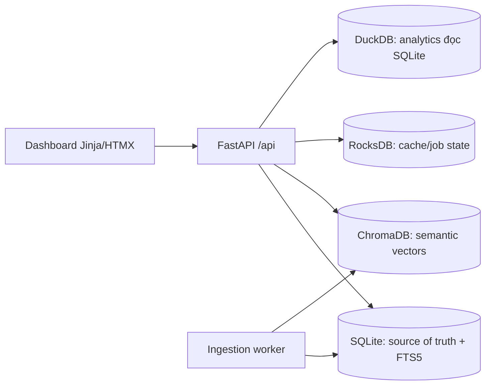

# InfoBoard

Dashboard local-first để lưu, tìm kiếm và liên kết các mẩu thông tin dạng text.

## Chạy local

```bash
uv sync
uv run uvicorn app.main:app --reload
```

Copy `.env.example` to `.env` to override local data paths.

API docs: http://127.0.0.1:8000/docs

## Kiến trúc



MVP hiện triển khai ingestion text, chunking, hash deduplication, SQLite FTS5, health, item listing/detail, search keyword và analytics cơ bản. Semantic indexing, upload/URL extractor, worker retry và UI dashboard sẽ được bổ sung theo các phase trong [docs/plan](docs/plan/).

## Kiểm thử

```bash
uv run pytest
uv run ruff check .
```
