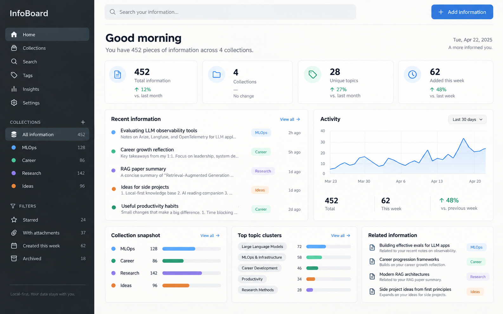
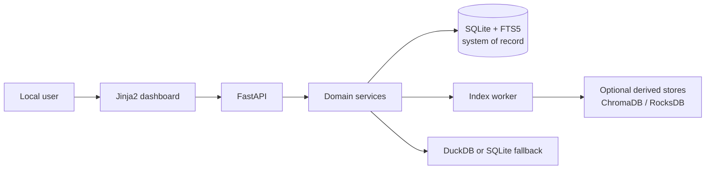

# InfoBoard

InfoBoard is an **Advanced Bookmark Manager** that runs on your machine:

- Save URLs and content snapshots for later reading.
- Add notes and collections to preserve context.
- Search by full text or semantic similarity.
- Expand toward browser data portability in the future.

SQLite and stored snapshots are the authoritative data sources. Semantic search, caching, and analytics are optional capabilities with safe fallback or rebuild paths.

## Preview



## Project status

InfoBoard is in the early stages of MVP implementation. FastAPI, SQLite/FTS5, ingestion, and the dashboard have working baselines, but most capabilities remain partial. Semantic indexing, durable recovery, complete quality gates, and release packaging are not finished yet.

See the evidence-based [current state](docs/plan/implementation/00-program/current-state.md) and the [master roadmap](docs/plan/implementation/00-program/roadmap.md).

## Run locally

Python 3.12 and `uv` are required:

```bash
uv sync
uv run uvicorn app.main:app --reload
```

The application runs locally at <http://127.0.0.1:8000> by default. API documentation is available at <http://127.0.0.1:8000/docs>.

Copy `.env.example` to `.env` if you need to override local data paths. Do not commit secrets or runtime data.

## Project map

| Path | Responsibility |
| --- | --- |
| [`app/`](app/) | FastAPI routes, domain services, worker, storage baseline, and analytics/semantic adapters |
| [`app/templates/`](app/templates/) | Server-rendered dashboard templates |
| [`tests/`](tests/) | Existing unit, API-flow, and search tests |
| [`data/`](data/) | Local SQLite, snapshot, and derived runtime data; never commit user data |
| [`docs/`](docs/) | Entry point for product, architecture, design, quality, operations, and implementation documentation |
| [`pyproject.toml`](pyproject.toml) | Python package metadata, core dependencies, and development tools |
| [`uv.lock`](uv.lock) | Dependency lockfile |
| [`.env.example`](.env.example) | Local configuration template without secrets |

## Documentation map

| Layer | Contents |
| --- | --- |
| [Product](docs/product/README.md) | Internal PRD, requirements, success criteria, and future plans |
| [Architecture](docs/architecture/README.md) | Tech stack, ERD, pipelines, recovery, and security boundaries |
| [Design](docs/design/README.md) | Information architecture, screens, UI states, responsive behavior, and mockups |
| [Quality](docs/quality/README.md) | Quality attributes, test strategy, evaluation, and MVP gates |
| [Operations](docs/operations/README.md) | Setup modes, backup/restore, diagnostics, upgrades, and rollback |
| [Implementation](docs/plan/implementation/README.md) | Milestones, epic plans, acceptance criteria, and execution evidence |

Start with the [documentation guide](docs/README.md). Files under `docs/plan/00–04` are compatibility entry points and are no longer canonical sources.

## Architecture summary



Core mode is based on FastAPI and SQLite/FTS5. Full mode adds embeddings, ChromaDB, RocksDB, and DuckDB, but these target capabilities are not fully packaged in the current dependency manifest. See the [tech stack](docs/architecture/01-tech-stack.md) for the distinction between current and target states.

## Testing

```bash
uv run pytest
uv run ruff check .
```

These commands represent the current baseline. Complete HTTP integration, security/recovery suites, benchmarks, and CI remain part of unfinished quality and implementation gates.
