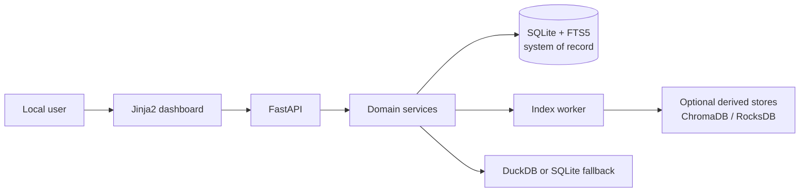

# InfoBoard

InfoBoard là knowledge hub local-first giúp một người dùng thu thập, lưu giữ, tổ chức và tìm lại thông tin cá nhân từ text, URL công khai và file. SQLite cùng stored snapshots là nguồn dữ liệu chính; semantic search, cache và analytics là các capability nâng cao có fallback hoặc rebuild path.

## Trạng thái dự án

Dự án đang ở giai đoạn đầu triển khai MVP. FastAPI, SQLite/FTS5, ingestion và dashboard đã có baseline nhưng phần lớn capability vẫn ở mức `partial`; semantic index, durable recovery, full quality gates và packaging chưa hoàn tất.

Xem trạng thái có bằng chứng tại [current state](docs/plan/implementation/00-program/current-state.md) và thứ tự triển khai tại [master roadmap](docs/plan/implementation/00-program/roadmap.md).

## Chạy local

Yêu cầu Python 3.12 và `uv`:

```bash
uv sync
uv run uvicorn app.main:app --reload
```

Ứng dụng mặc định chạy local tại <http://127.0.0.1:8000>; API docs tại <http://127.0.0.1:8000/docs>.

Sao chép `.env.example` thành `.env` khi cần thay đổi local data path. Không commit secret hoặc dữ liệu runtime.

## Project map

| Path | Vai trò |
| --- | --- |
| [`app/`](app/) | FastAPI routes, domain services, worker, storage baseline và analytics/semantic adapters |
| [`app/templates/`](app/templates/) | Dashboard template server-rendered |
| [`tests/`](tests/) | Unit, API-flow và search tests hiện có |
| [`data/`](data/) | SQLite/snapshots/derived runtime data local; không phải source code và không commit dữ liệu người dùng |
| [`docs/`](docs/) | Entry point cho toàn bộ product, architecture, design, quality, operations và implementation docs |
| [`pyproject.toml`](pyproject.toml) | Python package metadata, core dependencies và development tools |
| [`uv.lock`](uv.lock) | Dependency lockfile |
| [`.env.example`](.env.example) | Mẫu cấu hình local, không chứa secret |

## Documentation map

| Layer | Nội dung |
| --- | --- |
| [Product](docs/product/README.md) | Internal PRD, requirements, success criteria và Next Plan |
| [Architecture](docs/architecture/README.md) | Tech stack, ERD, pipelines, recovery và security boundaries |
| [Design](docs/design/README.md) | Information architecture, screens, UI states, responsive behavior và mockups |
| [Quality](docs/quality/README.md) | Quality attributes, test strategy, evaluation và MVP gates |
| [Operations](docs/operations/README.md) | Setup modes, backup/restore, diagnostics, upgrade và rollback |
| [Implementation](docs/plan/implementation/README.md) | Milestones, epic plans, acceptance và execution evidence |

Bắt đầu từ [documentation guide](docs/README.md). Các file `docs/plan/00–04` chỉ là compatibility entries, không còn là nguồn nội dung canonical.

## Architecture summary



Core mode dựa trên FastAPI và SQLite/FTS5. Full mode với embedding, ChromaDB, RocksDB và DuckDB là target capability chưa được đóng gói đầy đủ trong dependency manifest hiện tại. Xem [tech stack](docs/architecture/01-tech-stack.md) để phân biệt current và target state.

## Kiểm thử

```bash
uv run pytest
uv run ruff check .
```

Các lệnh trên phản ánh baseline hiện tại. HTTP integration, security/recovery suite, benchmark và CI đầy đủ vẫn thuộc các quality/implementation gates chưa hoàn tất.
