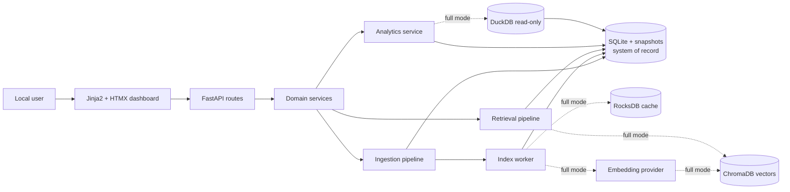

# Architecture — System overview

## Current state

FastAPI/Uvicorn, SQLite/FTS5, the server-rendered dashboard, and basic services exist at partial coverage. Minimal keyword search and ingestion work; the worker, semantic index, analytics, and recovery do not yet meet the target contract.

## Target contract

## Boundaries

- Routes parse, validate, and coordinate; business behavior lives in services.
- Storage adapters are the only boundary to the database.
- SQLite and stored snapshots are the authoritative data sources.
- ChromaDB, RocksDB, and DuckDB are derived stores with fallback or rebuild paths.
- Core mode does not depend on native semantic/analytics dependencies.

## Implementation gap

- Route, service, storage, and background-work boundaries exist only at partial coverage.
- Optional adapters and component-aware health do not yet satisfy the target boundaries.

## Owning work

Epics 10–11 establish application/data boundaries; epics 14–16 add worker, retrieval, and analytics adapters; epic 19 owns component health.

## Evidence required

Module-boundary tests, isolated application startup, core-only integration tests, and enabled-optional-component failure tests.
