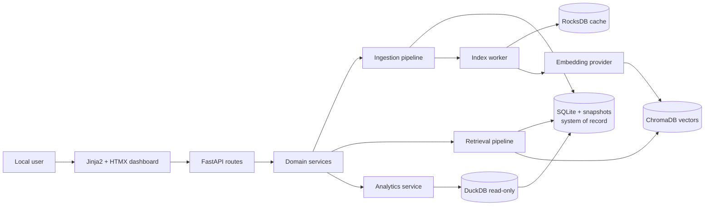

# Architecture — System overview

## Current state

FastAPI/Uvicorn, SQLite/FTS5, server-rendered dashboard và các service cơ bản đã có ở mức partial. Keyword search và ingestion tối thiểu hoạt động; worker, semantic index, analytics và recovery chưa hoàn thiện theo target contract.

## Target state

## Boundaries

- Routes parse/validate và điều phối; nghiệp vụ nằm trong services.
- Storage adapters là ranh giới duy nhất với database.
- SQLite và stored snapshots là nguồn dữ liệu có thẩm quyền.
- ChromaDB, RocksDB và DuckDB là derived stores, có fallback hoặc rebuild path.
- Core mode không phụ thuộc semantic/analytics native dependencies.
