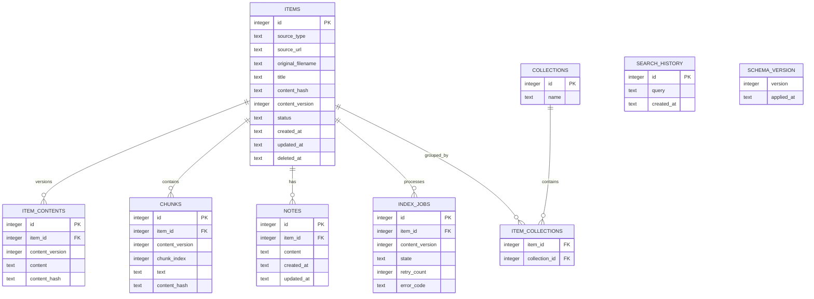

# Architecture — Data model and ERD

## Current state

SQLite schema và FTS5 đã tồn tại ở mức partial; chưa có migration history hoàn chỉnh. Bảng và tên cột trong target cần được xác nhận qua migration epic trước khi xem là production contract.

## Target state

## Invariants

- Foreign keys được bật; `(item_id, collection_id)` là unique.
- Snapshot/chunk thuộc content version cụ thể.
- `deleted_at` loại item khỏi mọi public read path.
- Notes và organization state không bị ghi đè bởi reindex.
- Schema thay đổi qua numbered migration, backup trước upgrade và upgrade test.
- FTS chỉ phản ánh current, non-deleted content và được giữ đồng bộ transactionally.
