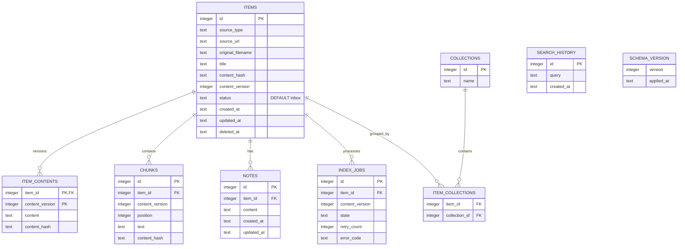

# Architecture — Data model and ERD

## Current state

The SQLite schema and FTS5 exist at partial coverage; migration history and the complete content-version schema are not implemented. The runtime currently uses `items.status DEFAULT 'active'`, `chunks.position`, one `item_contents` row per item, and `index_jobs.attempts`. The target below changes the default to `inbox`, the content key to `(item_id, content_version)`, and `attempts` to `retry_count` through epic 11.

## Target state

## Invariants

- Foreign keys are enabled; `(item_id, collection_id)` is unique.
- `item_contents` uses the composite key `(item_id, content_version)`; `chunks.position` is stable within each version.
- New items have the organization status `inbox` by default; the runtime `active` default is an M1 migration/behavior gap.
- `index_jobs.retry_count` is the target name; runtime `attempts` is converted through migration rather than kept in parallel.
- Each snapshot and chunk belongs to a specific content version.
- `deleted_at` excludes an item from every public read path.
- Reindexing does not overwrite notes or organization state.
- Schema changes use numbered migrations, backups before upgrade, and upgrade tests.
- FTS reflects only current, non-deleted content and is kept transactionally synchronized.
