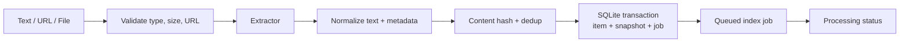

# Architecture — Ingestion pipeline

## Current state

Text/hash/chunk và extractor TXT/Markdown/PDF/URL đã có mức cơ bản. URL/PDF limits, redirect validation, parser hardening và durable handoff sang worker còn partial.

## Target state

## Source rules

- Text được lưu trực tiếp và là source duy nhất sửa content trong MVP.
- TXT/Markdown dùng bounded decoding/parser; PDF không có text trả lỗi unsupported rõ ràng.
- URL chỉ cho public HTTP(S), kiểm tra DNS/địa chỉ kết nối và từng redirect.
- Input duplicate giữ item hiện có, có thể attach collection mới nhưng không ghi đè note/status.
- File tạm phải được cleanup cả success và failure path.

## Transaction boundary

Item, snapshot/content version và index job được commit trong SQLite trước khi worker xử lý. Derived index không được dùng để xác nhận item đã được lưu.
