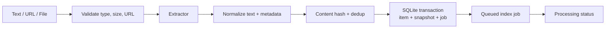

# Architecture — Ingestion pipeline

## Current state

Text/hash/chunk processing and TXT/Markdown/PDF/URL extractors exist at a basic level. URL/PDF limits, redirect validation, parser hardening, and durable handoff to the worker remain partial.

## Target state

## Source rules

- Text is stored directly and is the only source that edits content in the MVP.
- TXT/Markdown use bounded decoding/parsing; a textless PDF returns a clear unsupported error.
- URLs are limited to public HTTP(S), with DNS/connectivity checks on every redirect.
- Duplicate input keeps the existing item; it may attach a new collection but must not overwrite notes/status.
- Temporary files must be cleaned up on both success and failure paths.

## Transaction boundary

The item, snapshot/content version, and index job are committed in SQLite before worker processing. A derived index must not be used to confirm that an item was saved.
