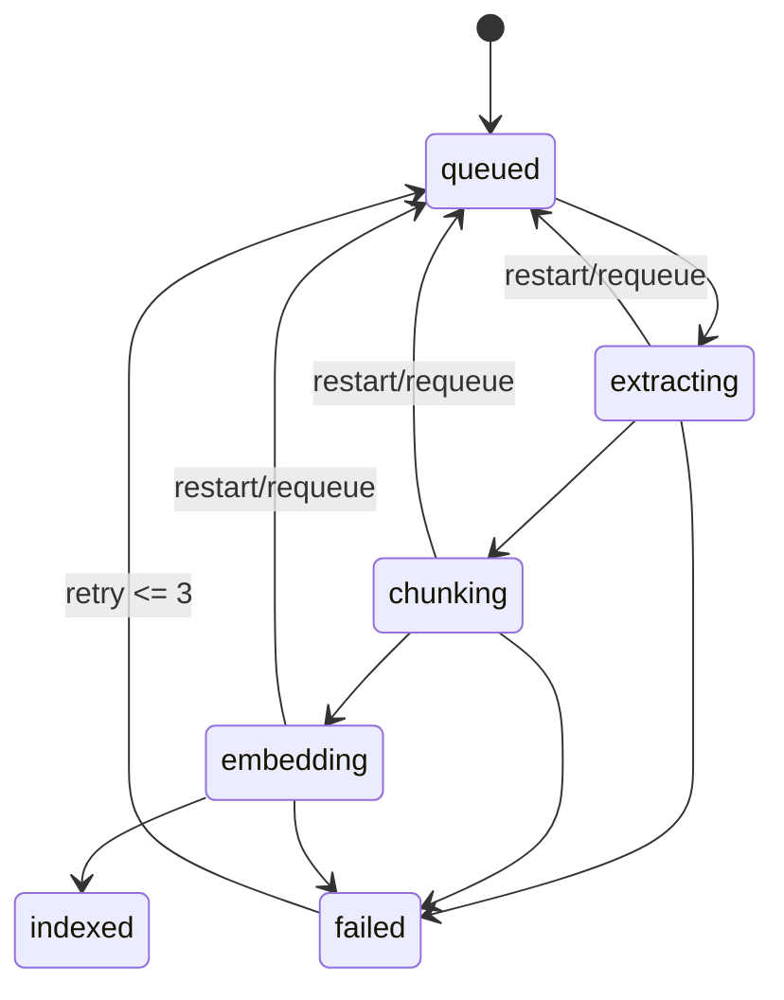
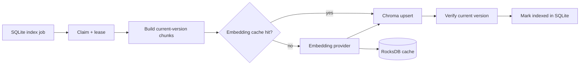

# Architecture — Indexing pipeline

## Current state

Worker lifecycle hiện là xử lý đồng bộ mô phỏng; chưa có background polling, durable lease, embedding thật hoặc persistent Chroma integration.

## Target state

## Invariants

- Worker chỉ index current content version của non-deleted item.
- Cache key gồm content hash, provider, model revision và dimension.
- Retry/upsert idempotent; restart requeue job đang xử lý.
- Quá retry limit chuyển `failed` và giữ error message an toàn.
- Xóa hoặc đổi version trước khi hoàn tất khiến worker skip/cleanup stale output.
