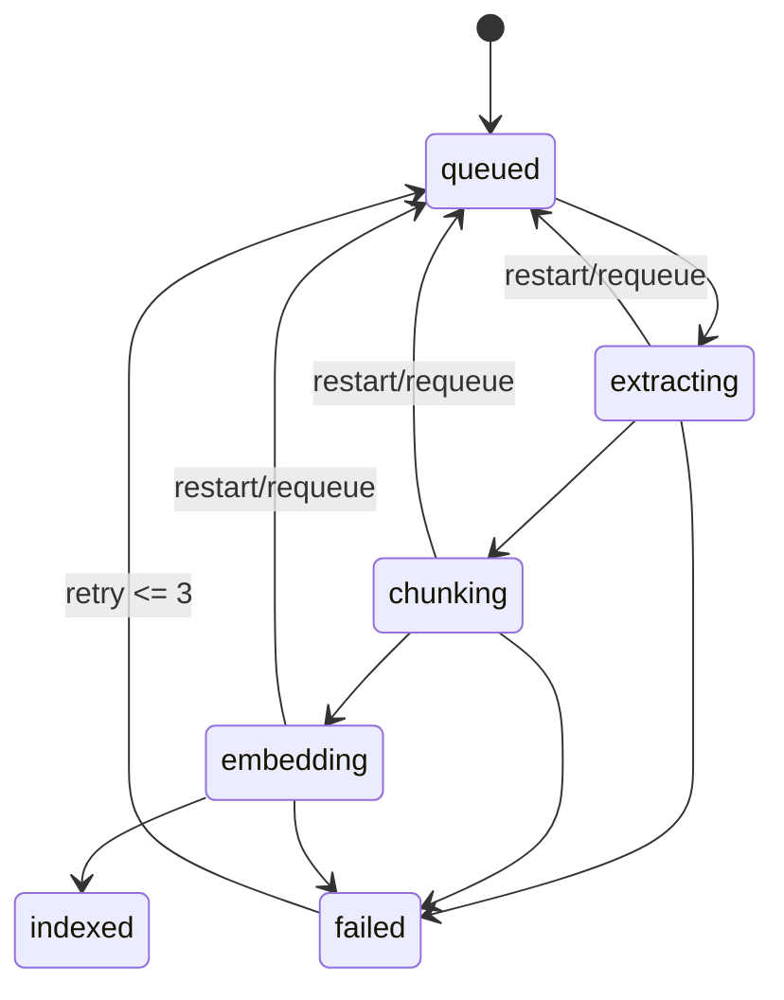
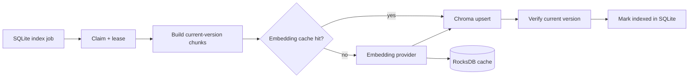

# Architecture — Indexing pipeline

## Current state

The current worker lifecycle is a synchronous simulation; background polling, durable leases, real embeddings, and persistent Chroma integration are not implemented.

## Target state

## Invariants

- The worker indexes only the current content version of a non-deleted item.
- The cache key includes content hash, provider, model revision, and dimension.
- Retry/upsert is idempotent; restart requeues jobs that were in progress.
- Exceeding the retry limit moves the job to `failed` with a safe error message.
- Deletion or a version change before completion causes the worker to skip or clean up stale output.

## UI projection

`extracting`, `chunking`, and `embedding` project to the UI state `processing`. `queued`, `indexed`, and `failed` remain unchanged; UI mapping does not change the durable SQLite job state.
