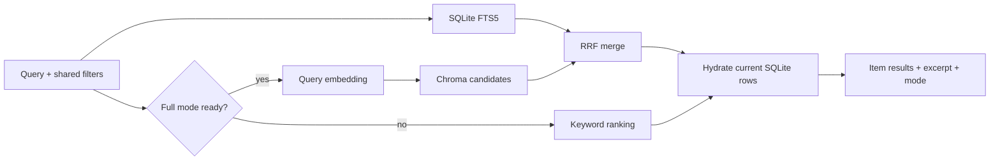
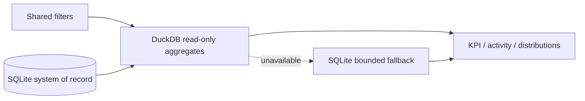

# Architecture — Search and analytics

## Current state

FTS5 keyword search và RRF utility đã có mức cơ bản nhưng chưa nối đầy đủ; Chroma semantic search chưa có. Analytics có SQLite fallback và DuckDB adapter tối thiểu.

## Target search pipeline

## Target analytics pipeline

## Rules

- Keyword search luôn usable trong core mode.
- Chroma chỉ trả chunk IDs/scores; content và metadata được hydrate từ SQLite.
- Deleted/stale-version candidates bị loại trước response.
- Analytics dùng cùng filter semantics với item list.
- DuckDB/Chroma failure trả degraded mode, không làm toàn dashboard/search lỗi.
