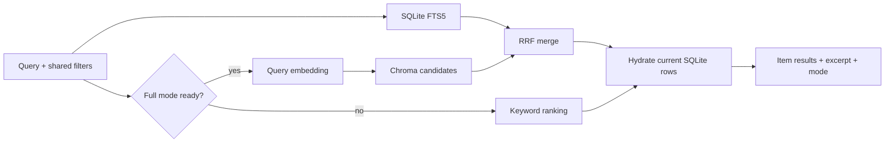
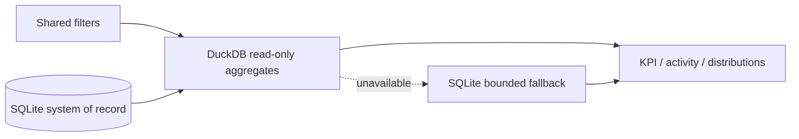

# Architecture — Search and analytics

## Current state

FTS5 keyword search and the RRF utility exist at a basic level but are not fully connected; Chroma semantic search is not implemented. Analytics has a minimal SQLite fallback and DuckDB adapter.

## Target contract — search and analytics pipelines

## Target analytics pipeline

## Rules

- Keyword search is always usable in core mode.
- Chroma returns only chunk IDs/scores; content and metadata are hydrated from SQLite.
- Deleted or stale-version candidates are removed before the response.
- Analytics uses the same filter semantics as the item list.
- Full mode not configured is a normal core-mode state and is not reported as degraded.
- Failure of an enabled DuckDB/Chroma component reports degraded mode without failing the core dashboard/search experience.

## Implementation gap

- FTS filters/excerpts and RRF are not connected to the complete target response pipeline.
- Persistent Chroma indexing is absent; analytics filter parity and optional-component state reporting are incomplete.

## Owning work

Epic 15 owns keyword retrieval and conditional semantic/hybrid behavior; epic 16 owns analytics and SQLite fallback; epic 19 owns component status reporting.

## Evidence required

Core multilingual retrieval tests, deleted/stale-version filtering, analytics parity fixtures, core-only health behavior, and conditional full-mode evaluation when enabled.
