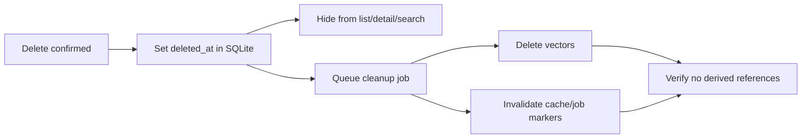
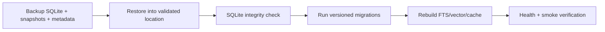

# Architecture — Lifecycle and recovery

## Current state

Soft delete và reindex endpoint tồn tại một phần; derived cleanup, versioned migrations và verified backup/restore/rebuild chưa hoàn chỉnh.

## Target delete pipeline

## Target recovery pipeline

## Recovery rules

- Backup tối thiểu gồm SQLite, snapshots và format/version metadata.
- Derived stores không cần nằm trong authoritative backup.
- Restore không ghi đè dữ liệu hiện có nếu chưa có explicit path/backup.
- Schema rollback dùng restore backup; không tự động down-migrate.
- Rebuild phải resumable/idempotent và không sửa notes/collections/status.
