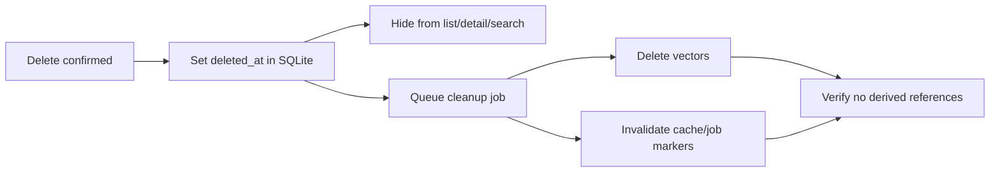
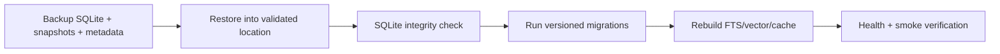

# Architecture — Lifecycle and recovery

## Current state

Soft delete and the reindex endpoint exist partially; derived cleanup, versioned migrations, and verified backup/restore/rebuild are incomplete.

## Target state — delete and recovery pipelines

## Target recovery pipeline

## Recovery rules

- A minimum backup includes SQLite, snapshots, and format/version metadata.
- Derived stores do not need to be part of the authoritative backup.
- Restore must not overwrite existing data without an explicit path/safety backup.
- Schema rollback uses backup restore; automatic down-migration is not supported.
- Rebuild must be resumable/idempotent and must not modify notes/collections/status.
