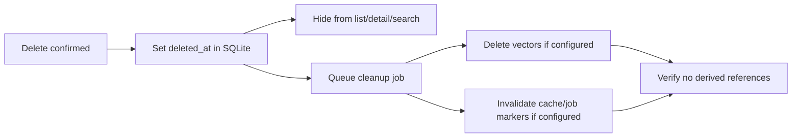
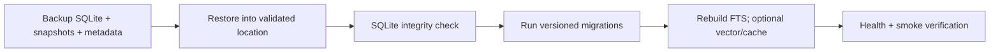

# Architecture — Lifecycle and recovery

## Current state

Soft delete and the reindex endpoint exist partially; derived cleanup, versioned migrations, and verified backup/restore/rebuild are incomplete.

## Target contract — delete and recovery pipelines

## Target recovery pipeline

## Recovery rules

- A minimum backup includes SQLite, snapshots, and format/version metadata.
- Derived stores do not need to be part of the authoritative backup.
- Restore must not overwrite existing data without an explicit path/safety backup.
- Schema rollback uses backup restore; automatic down-migration is not supported.
- Rebuild must be resumable/idempotent and must not modify notes/collections/status.
- Core-only recovery rebuilds required FTS; vector/cache rebuild applies only to explicitly configured full-mode components.

## Implementation gap

- Derived cleanup, backup manifests, verified restore, migration-on-restore, and resumable rebuild are not complete.
- No release evidence currently proves recovery from a copied database and snapshots.

## Owning work

Epic 11 owns migration compatibility; epic 14 owns resumable indexing; epic 18 owns backup/restore/rebuild and cleanup; epic 21 owns release integration.

## Evidence required

Soft-delete visibility tests, derived cleanup checks, backup manifest/checksum evidence, restore-to-new-location transcript, migration verification, and rebuild smoke tests.
