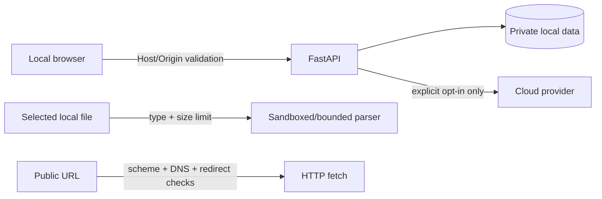

# Architecture — Security boundaries

## Current state

Ứng dụng bind local và có validation cơ bản; SSRF/redirect, Origin/Host, parser limits, log redaction và component health test còn partial hoặc draft.

## Target state — security boundaries

## Controls

- Bind `127.0.0.1`; mở network là capability mới cần authentication threat model.
- Validate Host/Origin cho state-changing request.
- Chặn private, loopback, link-local và metadata-service destinations ở từng redirect/connect.
- Bounded size/time/type cho upload, fetch, extraction và query limits.
- Escape imported content; không render active markup/script.
- Không log content, query nhạy cảm, filesystem detail, token hoặc secret.
- Cloud/provider traffic chỉ bật qua explicit configuration và báo rõ degraded/failure.
