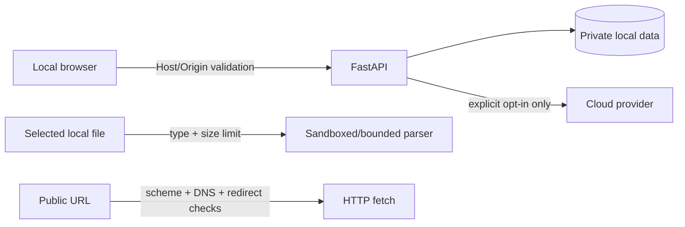

# Architecture — Security boundaries

## Current state

The application binds locally and has basic validation; SSRF/redirect, Origin/Host, parser limits, log redaction, and component health tests remain partial or draft.

## Target state — security boundaries

## Controls

- Bind to `127.0.0.1`; network exposure is a new capability requiring an authentication threat model.
- Validate Host/Origin for state-changing requests.
- Block private, loopback, link-local, and metadata-service destinations at every redirect/connect step.
- Apply bounded size/time/type limits to uploads, fetches, extraction, and queries.
- Escape imported content; do not render active markup/scripts.
- Do not log content, sensitive queries, filesystem details, tokens, or secrets.
- Enable cloud/provider traffic only through explicit configuration and report degraded/failure states clearly.
