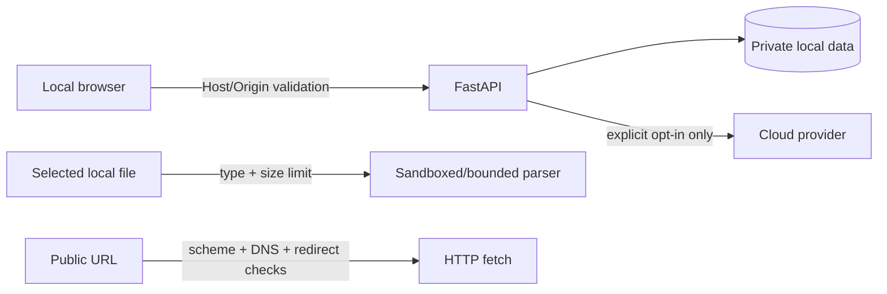

# Architecture — Security boundaries

## Current state

The application binds locally and has basic validation; SSRF/redirect, Origin/Host, parser limits, log redaction, and component health tests remain partial or draft.

## Target contract — security boundaries

## Controls

- Bind to `127.0.0.1`; network exposure is a new capability requiring an authentication threat model.
- Validate Host/Origin for state-changing requests.
- Block private, loopback, link-local, and metadata-service destinations at every redirect/connect step.
- Apply bounded size/time/type limits to uploads, fetches, extraction, and queries.
- Escape imported content; do not render active markup/scripts.
- Do not log content, sensitive queries, filesystem details, tokens, or secrets.
- Enable cloud/provider traffic only through explicit configuration and report degraded/failure states clearly.

## Implementation gap

- Redirect-aware SSRF protection, bounded parsers, Origin/Host validation, log redaction, and security-focused health tests remain partial or absent.
- Provider traffic is a future/conditional boundary and has no release evidence.

## Owning work

Epic 13 owns bounded source handling; epic 17 owns application/network/render/log controls; epic 19 owns safe diagnostics; post-MVP provider work remains behind discovery gates.

## Evidence required

Private-network and redirect fixtures, upload/fetch/query limit tests, Origin/Host rejection, active-markup escaping, log-redaction tests, and explicit provider-consent evidence when applicable.
