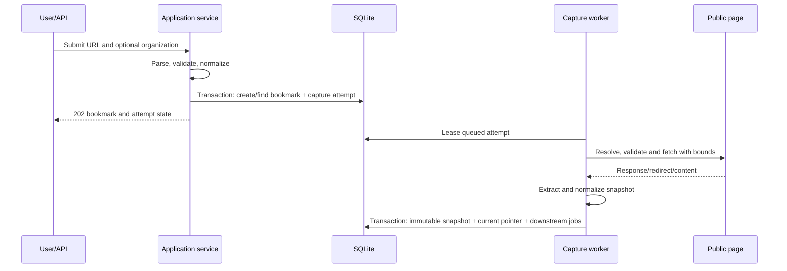

# Capture pipeline

## Transaction and job flow

Bookmark creation commits before network fetch. Capture completion commits one immutable successful snapshot, links it to the attempt, advances `current_snapshot_id`, and queues keyword, semantic, and analytics jobs in one canonical transaction. Pending and failed attempts never create snapshot rows.

## URL validation and normalization

- Accept only absolute `http` and `https` URLs.
- Reject credentials in URLs, unsupported ports by policy, malformed hosts, and non-public destinations.
- Lowercase scheme/host, normalize international host names, remove the default port, remove fragments, normalize path dot segments, and apply one documented query-parameter ordering/tracking policy.
- Preserve `original_url`; use `canonical_url` only for identity.
- Resolve DNS and validate every address before connection. Validate the actual connected address and every redirect target to resist rebinding and redirect SSRF.

The exact tracking-parameter allow/deny list is versioned. Changing it requires a migration/deduplication decision rather than silently changing identity.

## Fetch limits

- Bound connect, read, total request, redirect count, response bytes, decompressed bytes, and extraction time.
- Accept HTML and plain web documents supported by the extractor contract; reject executable/binary payloads.
- Use an explicit InfoBoard user agent and no ambient browser cookies, credentials, proxy credentials, or local session state.
- Store only safe response provenance. Raw headers are neither canonical metadata nor public diagnostics.
- Treat fetched content as untrusted and sanitize/escape it at every render boundary.

## Snapshot commit

- A capture attempt has its own monotonically increasing attempt number. The next snapshot content version is allocated only inside the successful commit.
- Raw/extracted files are written to a temporary path, checksummed, and atomically moved into a versioned managed location before the SQLite commit references them.
- Extraction produces normalized title/description candidates and text. User-overridden metadata remains authoritative.
- Identical content checksum may complete the job without creating a redundant current version; capture provenance may be recorded separately.

## Failure and retry

| Failure | Canonical effect | Retry |
| --- | --- | --- |
| Invalid/unsafe URL | No bookmark or job created | User corrects input |
| Duplicate URL | Existing bookmark returned | Explicit recapture only |
| DNS/redirect/SSRF rejection | Bookmark retained; snapshot attempt failed | Allowed after source/config changes |
| Timeout/size/type/extraction failure | Bookmark retained; current ready snapshot unchanged | Requeue same logical capture operation |
| Process crash before commit | Attempt lease expires; temporary files cleaned | Worker safely resumes/retries |
| Downstream index failure | Snapshot remains current and readable | Downstream job retries independently |

Retry increments a bounded counter, clears expired lease metadata, and never mutates notes, collections, tags, status, or the current snapshot. Automatic retries use 1-, 5-, and 30-second delays for a maximum of three attempts. After exhaustion, manual retry starts one new three-attempt retry cycle on the same logical capture attempt.

## Outputs

A successful capture produces a ready current snapshot plus durable jobs for local keyword indexing, semantic indexing under the active revision, and analytics refresh. If semantic consent/configuration is not ready, semantic work remains blocked/unconfigured rather than making capture fail.
