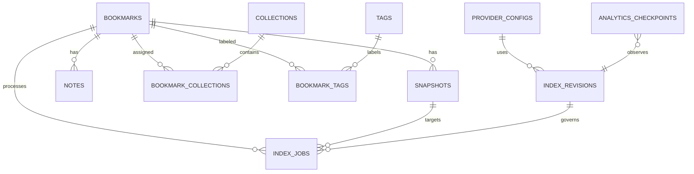

# Canonical data model

SQLite owns every canonical entity, relationship, lifecycle state, and recovery checkpoint. DDL names below are the target contract; migrations must preserve existing user data when runtime implementation begins.

## ERD

## Tables

### `bookmarks`

| Column | Contract |
| --- | --- |
| `id` | Stable UUID primary key. |
| `canonical_url` | Normalized HTTP(S) URL; unique among non-deleted bookmarks by deterministic identity policy. |
| `original_url` | First user-submitted URL for provenance. |
| `title`, `description` | User-editable metadata; extractor updates only fields not explicitly overridden. |
| `source_domain` | Normalized host used by filters. |
| `status` | `inbox`, `active`, or `archived`; default `inbox`. |
| `current_snapshot_version` | Nullable positive integer advanced only after snapshot commit. |
| `created_at`, `updated_at` | UTC timestamps. |
| `deleted_at` | Nullable UTC soft-delete timestamp. |

### `snapshots`

Primary key is `(bookmark_id, content_version)`.

| Column | Contract |
| --- | --- |
| `bookmark_id`, `content_version` | Immutable bookmark version identity. |
| `state` | `pending`, `processing`, `ready`, or `failed`. |
| `final_url`, `http_status`, `content_type` | Safe capture provenance. |
| `raw_content_ref`, `extracted_text_ref` | Local managed-file references; paths are never public response fields. |
| `content_checksum` | Hash of normalized extracted content. |
| `captured_at` | Nullable UTC time of successful capture. |
| `error_code` | Nullable stable safe code; no raw body or secret. |
| `created_at`, `updated_at` | UTC timestamps. |

### Organization

- `collections(id, name, normalized_name, created_at, updated_at)` with unique normalized name.
- `bookmark_collections(bookmark_id, collection_id, created_at)` with composite primary key.
- `tags(id, name, normalized_name, created_at)` with unique normalized name.
- `bookmark_tags(bookmark_id, tag_id, created_at)` with composite primary key.
- `notes(id, bookmark_id, body, created_at, updated_at)`; body is user-authored and independent of snapshots.

Deleting a collection or tag cascades only through its join table. Bookmark deletion remains soft and does not cascade canonical content until a separately specified retention policy exists.

### `index_jobs`

| Column | Contract |
| --- | --- |
| `id` | Stable UUID primary key. |
| `bookmark_id`, `content_version` | Target snapshot identity. |
| `job_type` | `capture`, `keyword_index`, `semantic_index`, `analytics_refresh`, or `derived_cleanup`. |
| `state` | `queued`, `processing`, `indexed`, or `failed`; capture uses `indexed` to mean completed pipeline step. |
| `index_revision_id` | Nullable for capture; required for versioned derived work. |
| `retry_count`, `max_retries` | Bounded retry counters. |
| `lease_owner`, `lease_expires_at` | Nullable claim metadata for crash recovery. |
| `checkpoint` | Bounded JSON progress metadata without raw content or secrets. |
| `error_code`, `last_error_at` | Safe failure metadata. |
| `created_at`, `updated_at`, `completed_at` | UTC timestamps. |

Only one active job may exist for `(bookmark_id, content_version, job_type, index_revision_id)`. Retry requeues that logical job rather than creating duplicate work.

### Provider and index metadata

- `provider_configs(id, endpoint, model_id, api_key_ref, timeout_ms, consent_state, consented_at, revoked_at, created_at, updated_at)` stores a secret reference, never the API key value.
- `index_revisions(id, provider_config_id, model_id, vector_dimension, chunking_revision, schema_version, state, created_at, retired_at)` identifies compatibility boundaries.
- `analytics_checkpoints(id, index_revision_id, source_updated_at, projection_updated_at, projection_checksum, state)` records DuckDB freshness.

`consent_state` is `not_granted`, `granted`, or `revoked`. Endpoint verification does not set it to `granted`.

## Canonical invariants

1. Bookmark persistence is independent of snapshot success.
2. `current_snapshot_version` points only to a committed `ready` snapshot; failed attempts do not replace it.
3. Notes, collections, tags, and bookmark status are never changed by capture, indexing, or rebuild.
4. User-facing retrieval accepts only non-deleted bookmarks and their current snapshot version.
5. Derived records include bookmark ID, content version, and index revision.
6. URL deduplication is deterministic; duplicate submission never overwrites personal context.
7. API keys are external secrets referenced by opaque identifier.
8. All timestamps are stored in UTC and serialized as RFC 3339.
