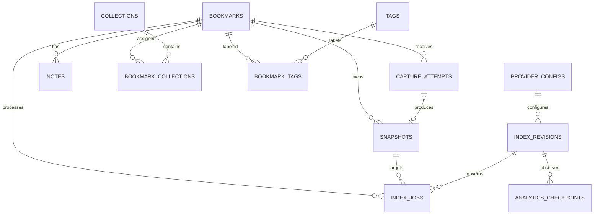

# Canonical data model

SQLite owns every canonical entity, relationship, lifecycle state, configuration record, and recovery checkpoint. FTS5 tables live in the same database file but are derived and rebuildable. Names and constraints below are the target migration contract.

## ERD



## Canonical tables

### `bookmarks`

| Column | Contract |
| --- | --- |
| `id` | Stable SQLite `INTEGER PRIMARY KEY`; existing item IDs are preserved. |
| `source_kind` | `url`, `legacy_text`, or `legacy_file`. |
| `canonical_url` | Nullable for legacy sources; URL-normalization-v1 output for URL sources. |
| `original_url` | First submitted/source URL for provenance; nullable for legacy sources. |
| `url_normalization_revision` | `1` for normalized URL sources; null for legacy sources. |
| `title`, `description`, `source_domain` | Display/filter metadata. Domain is null for non-URL legacy content. |
| `title_is_user_edited`, `description_is_user_edited` | Boolean guards preventing recapture from overwriting explicit edits. |
| `status` | `inbox`, `active`, or `archived`; default `inbox`. |
| `current_snapshot_id` | Nullable foreign key to a successful snapshot owned by this bookmark. |
| `version` | Positive optimistic-concurrency integer; starts at 1 and increments on bookmark or membership mutation. |
| `created_at`, `updated_at` | UTC timestamps. |
| `deleted_at` | Nullable UTC soft-delete timestamp; retained indefinitely in MVP. |

Required partial uniqueness:

```sql
CREATE UNIQUE INDEX uq_active_bookmark_url
ON bookmarks(canonical_url)
WHERE source_kind = 'url' AND deleted_at IS NULL;
```

Resaving a deleted URL creates a new active row; it never silently undeletes the retained row. Legacy source rows have no URL uniqueness requirement.

### `capture_attempts`

Capture attempts own pending, running, retry, failure, and lease state. They are not content versions.

| Column | Contract |
| --- | --- |
| `id` | SQLite integer primary key. |
| `bookmark_id`, `attempt_number` | Target bookmark and monotonically increasing per-bookmark attempt number; unique together. |
| `state` | `queued`, `processing`, `succeeded`, or `failed`. |
| `resulting_snapshot_id` | Nullable unique snapshot produced by this attempt; set only on success. |
| `retry_count`, `max_retries` | Starts at 0; `max_retries` is 3 for MVP. |
| `lease_owner`, `lease_expires_at` | Nullable in-process worker claim metadata. |
| `checkpoint` | Bounded JSON state without raw content, headers, local paths, or secrets. |
| `error_code`, `last_error_at` | Stable safe error metadata. |
| `created_at`, `updated_at`, `completed_at` | UTC timestamps. |

Only one active (`queued` or `processing`) capture attempt may exist per bookmark, enforced by a partial unique index. Manual retry requeues the latest retryable failed attempt; explicit recapture after success creates the next attempt number.

### `snapshots`

Snapshots are immutable successful content versions. Pending and failed attempts never create snapshot rows.

| Column | Contract |
| --- | --- |
| `id` | SQLite integer primary key. |
| `bookmark_id`, `content_version` | Owner and monotonically increasing successful version; unique together. |
| `capture_attempt_id` | Unique producing attempt. |
| `final_url`, `http_status`, `content_type` | Safe capture provenance. |
| `raw_content_ref`, `extracted_text_ref` | Managed local-file references; never API response fields. |
| `content_checksum` | Hash of normalized extracted content. |
| `captured_at`, `created_at` | UTC timestamps. |

Snapshot rows are never updated except by a data-repair migration with explicit evidence. A successful capture transaction inserts the snapshot, links the attempt, advances `current_snapshot_id`, and creates downstream jobs atomically. A failed recapture leaves the prior current snapshot unchanged.

### Organization

- `collections(id, name, normalized_name, version, created_at, updated_at)` uses integer IDs and unique normalized names.
- `bookmark_collections(bookmark_id, collection_id, created_at)` uses a composite primary key.
- `tags(id, name, normalized_name, version, created_at, updated_at)` uses integer IDs and unique normalized names.
- `bookmark_tags(bookmark_id, tag_id, created_at)` uses a composite primary key.
- `notes(id, bookmark_id, body, version, created_at, updated_at)` uses integer IDs; note content is independent of snapshots.

Deleting a collection/tag removes memberships only. Membership mutation increments the owning bookmark version. Collection, tag, and note updates increment their own version.

### `index_jobs`

| Column | Contract |
| --- | --- |
| `id` | SQLite integer primary key. |
| `bookmark_id`, `snapshot_id` | Target current successful snapshot; snapshot may be null only for cleanup. |
| `job_type` | `keyword_index`, `semantic_index`, `analytics_refresh`, or `derived_cleanup`. |
| `state` | `queued`, `processing`, `succeeded`, or `failed`. |
| `index_revision_id` | Required for semantic jobs; nullable for keyword/analytics/cleanup where their revision is encoded in checkpoint. |
| `retry_count`, `max_retries` | Bounded retry counters; maximum 3 for MVP. |
| `lease_owner`, `lease_expires_at` | Nullable worker claim metadata. |
| `checkpoint`, `error_code`, `last_error_at` | Bounded safe progress/failure metadata. |
| `created_at`, `updated_at`, `completed_at` | UTC timestamps. |

Separate partial unique indexes enforce one active logical job for each job type and its applicable non-null identity. The implementation must not rely on a normal SQLite unique constraint containing null columns.

### Provider and projection metadata

- `provider_configs(id, endpoint, model_id, timeout_ms, consent_state, disclosure_version, consented_at, revoked_at, version, created_at, updated_at)` stores no API key or secret reference.
- `index_revisions(id, provider_config_id, model_id, vector_dimension, chunking_revision, schema_version, state, created_at, activated_at, retired_at)` identifies semantic compatibility boundaries.
- `analytics_checkpoints(id, projection_revision, source_updated_at, projection_updated_at, projection_checksum, state)` records DuckDB freshness.

`consent_state` is `not_granted`, `granted`, or `revoked`. Runtime key availability comes only from `INFOBOARD_SEMANTIC_API_KEY` and is never persisted.

## Migration from runtime baseline

The forward migration preserves user-owned identifiers and data:

| Current runtime | Target mapping |
| --- | --- |
| `items.id` | `bookmarks.id` unchanged. |
| `items.source_type = 'url'` | `source_kind = 'url'`; normalize `source_url` with policy v1 and record original URL. |
| Other `items.source_type` | `legacy_text` or `legacy_file` based on known file-like source types; all others become `legacy_text`. |
| `items.status = 'deleted'` | Set `deleted_at` from existing value and canonical status to `active`; deletion remains authoritative through `deleted_at`. |
| Other valid/invalid status | Preserve `active`/`archived`; map unknown values to `inbox` and record migration count. |
| `item_contents` | Create immutable snapshot version 1 for each non-empty item and set `current_snapshot_id`. |
| URL item without usable content | Preserve bookmark with no snapshot; create a failed migration capture attempt with a safe code. |
| `collections`, `item_collections`, `notes` | Preserve integer IDs, relationships, bodies, and timestamps; initialize versions to 1. |
| `chunks`, `items_fts` | Do not migrate as authority; rebuild from current snapshots. |
| `index_jobs` | Do not reinterpret legacy state; record aggregate migration evidence and enqueue fresh target jobs. |
| `search_history` | Exclude from the target schema because it is non-essential sensitive history; retain only in the verified pre-migration backup. |

The migration runs against a verified backup, records source/target counts and mapping exceptions, and aborts without switching databases if canonical items, contents, collections, memberships, or notes cannot be preserved.

## Invariants

1. Bookmark persistence is independent of capture success.
2. `current_snapshot_id` references only an immutable successful snapshot owned by the bookmark.
3. Capture/index/rebuild never mutates notes, collections, tags, status, or user-edited metadata.
4. User-facing reads accept only non-deleted bookmarks and current snapshots.
5. Derived records include bookmark ID, snapshot/content version, and applicable revision.
6. Duplicate submission never overwrites personal context.
7. Secrets are never stored in SQLite.
8. All timestamps are UTC and serialized as RFC 3339.
