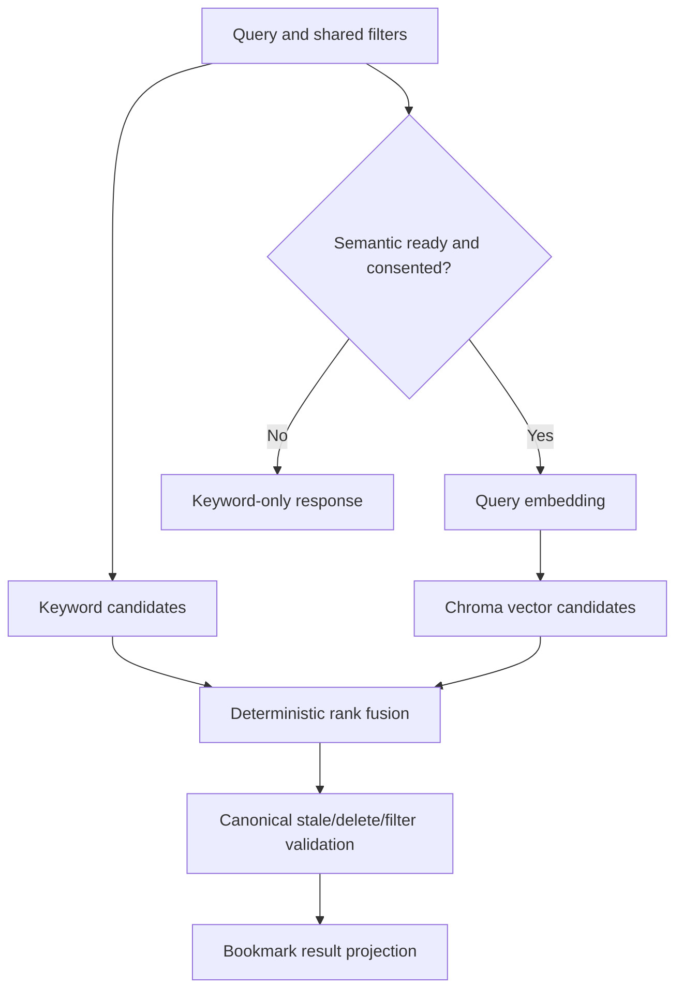

# Indexing and search

## Index revision

An index revision is the compatibility boundary for all derived retrieval data:

```text
provider configuration identity
+ model ID
+ vector dimension
+ chunking revision
+ schema version
```

Changing any component creates a new revision. The old revision is never mixed into candidate generation and remains removable after the new revision passes completeness and smoke checks.

## Document indexing

1. Claim a semantic-index job for the current ready snapshot.
2. Reconfirm bookmark is not deleted and the content version is current.
3. Normalize and chunk text using the revision's deterministic algorithm.
4. Build a cache key from revision identity and normalized chunk checksum.
5. Read a compatible vector from RocksDB or call the configured embedding endpoint.
6. Validate response count, numeric values, model metadata, and vector dimension.
7. Cache validated embeddings in RocksDB.
8. Upsert deterministic chunk IDs and metadata into the revision's ChromaDB namespace.
9. Mark the durable job `succeeded` only after all current chunks are present.
10. Remove stale version entries through an idempotent cleanup job.

Provider requests are bounded by batch size, text length, timeout, concurrency, and retry policy. Partial batches remain retryable and never activate an incomplete revision.

## Keyword indexing

SQLite FTS5 indexes current title, description, canonical URL/domain, tags, collection names, notes where accepted by privacy policy, and current snapshot text. FTS synchronization occurs through explicit service/worker operations that can be fully rebuilt and tested; user-facing queries always join back to non-deleted canonical bookmarks.

## Query flow



- Keyword mode executes only the local path.
- Semantic mode requires provider and active Chroma revision; if unavailable, the response uses keyword fallback and reports the actual mode/degradation.
- Hybrid mode retrieves independent bounded candidate sets and applies reciprocal-rank fusion using versioned constants and stable tie-breaking by bookmark ID.
- Filters are applied as early as each backend supports and always revalidated against SQLite.
- Chunk candidates collapse to one bookmark using the best contributing rank before final projection.

## Result contract

Search returns bookmark-level results with title, URL/domain, excerpt, organization context, current snapshot version, requested mode, actual mode, and safe degradation metadata. Scores are comparable only within a response and are not product guarantees.

Excerpt priority is matched current snapshot text, then description, then URL/title metadata. Content is escaped; highlighting is applied after safe segmentation.

## Failure matrix

| Component | Behavior |
| --- | --- |
| Provider unconfigured or consent absent | Semantic status `unconfigured`; keyword available; setup action shown. |
| Provider timeout/error after setup | Semantic status `degraded`; bounded retries; keyword fallback. |
| RocksDB unavailable/corrupt | Bypass cache; provider may be called only with consent; schedule cache rebuild. |
| ChromaDB unavailable/incompatible | Skip vectors; keyword fallback; schedule revision rebuild. |
| FTS unavailable | List/detail remain readable, but retrieval health is `unavailable`; semantic-only output is not presented as healthy core search. |
| Stale/deleted candidate | Drop after SQLite validation and enqueue cleanup. |

## Consent revocation

Revocation prevents all new document and query embedding calls immediately, pauses semantic jobs, switches searches to keyword mode, and enqueues explicit cleanup for local semantic cache/vector data. It never removes SQLite snapshots or organization data.
