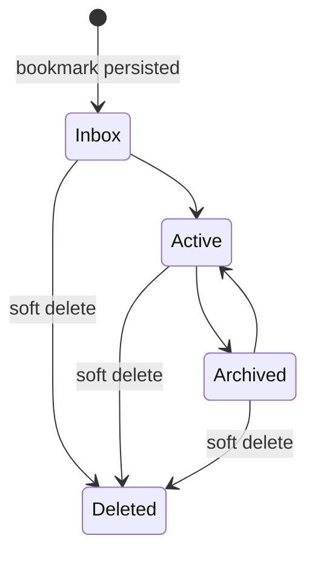
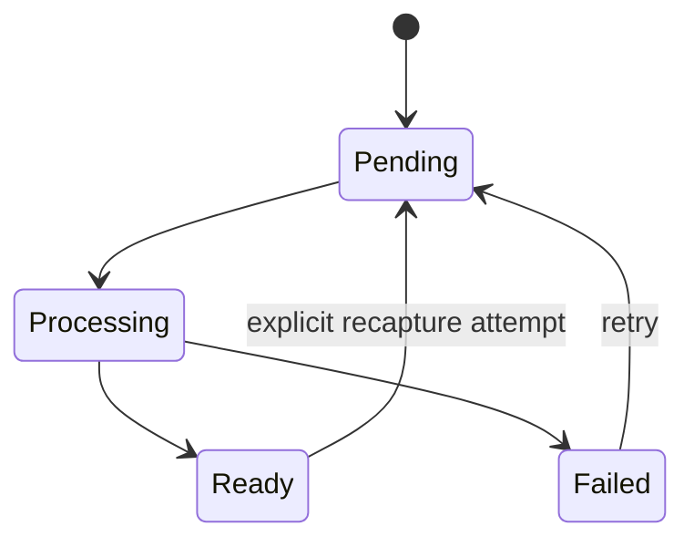

# Lifecycle and recovery

## Bookmark and snapshot lifecycle



Organization state is independent from snapshot and index state. Soft delete sets `deleted_at`, excludes the bookmark immediately, and queues derived cleanup. Permanent purge is not an MVP user action.



A ready snapshot remains current while recapture is pending or failed. Only a committed new ready snapshot advances the current version.

## Durable jobs and restart

- Workers acquire bounded leases in SQLite transactions.
- A worker renews its lease only while making progress and writes bounded checkpoints at idempotent boundaries.
- On startup, expired `processing` jobs return to `queued` when retries remain; otherwise they become `failed` with a stable interruption code.
- Completion verifies that the bookmark is non-deleted, the target version is current where required, and the index revision is still valid.
- Duplicate completion/upsert is harmless. Stale jobs finish as cancelled/failed cleanup outcomes without changing current state.

## Delete and consent cleanup

- Soft delete queues FTS, RocksDB, ChromaDB, and DuckDB cleanup identified by bookmark/version/revision.
- Retrieval validates SQLite before returning candidates, so delayed cleanup cannot leak deleted data.
- Consent revocation pauses external semantic work and queues local RocksDB/Chroma semantic cleanup. It does not delete snapshots or keyword data.
- Regranting consent creates or resumes work under a compatible active/new revision; it does not assume old cache/vector completeness.

## Backup contract

Required backup contains:

- A transactionally consistent SQLite backup.
- Managed raw/extracted snapshot files referenced by SQLite.
- Manifest with application version, schema version, backup time, canonical paths relative to the archive, file sizes, and checksums.

RocksDB, ChromaDB, and DuckDB are excluded from required backup. Including them as optional acceleration artifacts never removes the requirement to verify they match the manifest revision before use.

## Restore and rebuild

1. Resolve source and destination; refuse to overwrite populated canonical data without a verified safety backup.
2. Validate manifest and checksums in a temporary/explicit location.
3. Open restored SQLite read-only, run integrity and foreign-key checks, and validate managed snapshot references.
4. Run versioned migrations with rollback to the safety backup on failure.
5. Start with external calls disabled until restored consent/configuration is reviewed.
6. Rebuild in order:

```text
current SQLite snapshots
-> SQLite FTS5 keyword index
-> RocksDB embedding cache
-> ChromaDB semantic vectors
-> DuckDB analytics projection
-> health and consistency verification
```

RocksDB/Chroma rebuild requires valid consent and a verified provider. If unavailable, restore completes for canonical/keyword use and records semantic degraded/unconfigured work still required. DuckDB failure similarly leaves canonical and retrieval workflows intact.

## Rebuild guarantees

- Explicit target and resolved path are displayed before destructive derived-store replacement.
- Build into staging/new revision; activate only after completeness, current-version, deletion, dimension, and smoke checks pass.
- Rebuild is resumable and idempotent and never changes notes, collections, tags, status, URLs, or snapshots.
- Failure preserves canonical data and the last safe active derived revision where compatible.
- Every run records environment, revision, counts, checksum, duration, error code, and final health without raw user content.
