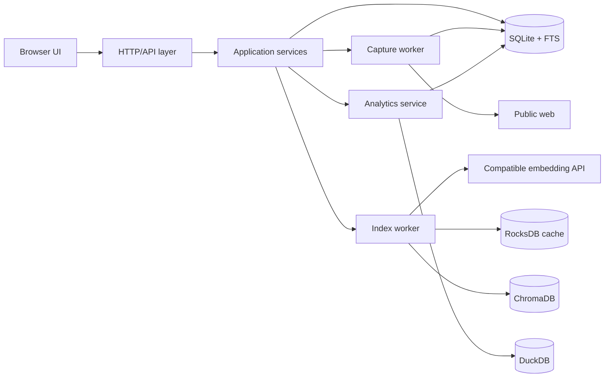

# System overview

## Context

InfoBoard is a single-user local web application. The browser connects to a process bound to loopback. Canonical data and snapshots remain on the local filesystem. The only intended external data flows are public-page capture and consented calls to a configured OpenAI-compatible embedding endpoint.

## Component contracts

| Component | Responsibility | Input/output | Failure and recovery | Health | Delivery stage |
| --- | --- | --- | --- | --- | --- |
| Browser UI | Capture, organize, retrieve, settings, and maintenance interaction | HTML/JSON over loopback HTTP | Preserve user context and show safe next action | Derived from API | 3–5 |
| HTTP/API | Validate requests, apply origin/host boundary, expose stable envelopes | Versioned request/response contracts | Reject before mutation; correlation ID for diagnosis | `ready` when app services initialize | 1 |
| Application services | Enforce product invariants and transaction boundaries | Typed commands/queries | Roll back canonical transaction; never infer truth from derived stores | `ready` with SQLite | 1–3 |
| Capture worker | Fetch public URLs and create versioned snapshots | Durable SQLite jobs | Retry with limits; bookmark survives failure | `ready/degraded/unavailable` | 2 |
| Index worker | Chunk, embed, index, and checkpoint current versions | Durable SQLite jobs; derived writes | Idempotent retry and rebuild | Per component | 4–7 |
| Search orchestrator | Keyword, semantic, and hybrid candidate/ranking flow | Query/filter contract to bookmark results | Keyword fallback on semantic failure | `ready/degraded` | 4–6 |
| Analytics service | Shared-filter metrics and projection refresh | Filter contract to KPI response | Bounded SQLite fallback | `ready/degraded` | 8 |
| Maintenance service | Migration, backup, restore, rebuild, and integrity checks | Explicit local commands/actions | Fail closed with canonical data untouched | Detailed component report | 9 |
| SQLite/FTS5 | Canonical data, jobs, configuration metadata, keyword index | Transactional SQL | Core unavailable if integrity/readiness fails | Required `ready` | 1–4 |
| RocksDB | Embedding cache | Versioned cache keys/values | Cache miss and rebuild | Derived status | 7 |
| ChromaDB | Current semantic vectors | Versioned upserts/queries | Semantic degradation and rebuild | Derived status | 6 |
| DuckDB | Analytics projection | Refresh/read-only aggregate queries | SQLite fallback and rebuild | Derived status | 8 |
| Embedding endpoint | Produce document/query vectors | OpenAI-compatible request/response | Bounded retry then semantic degradation | `unconfigured/ready/degraded` | 5 |

## Layer rules

- HTTP handlers contain no storage-specific business logic.
- Application services are the only writers of canonical user state.
- Workers claim durable jobs from SQLite and report state through SQLite transactions.
- Search and analytics may read derived stores but validate candidates against current canonical state.
- Maintenance operations use explicit paths and never run as a side effect of a dashboard request.
- The process binds to `127.0.0.1` for MVP; opening a network interface requires a new threat model and authentication decision.
