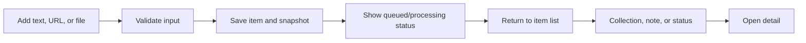

# Design — Core flows and screens

## Screen inventory

| Screen/surface | Milestone | Mode | Primary purpose |
| --- | --- | --- | --- |
| Dashboard | M1 | Core | Overview, recent items, processing status, and entry to Add |
| Add dialog/form | M1 | Core | Create a text, URL, or file item |
| Item list | M1 | Core | Browse items and preserve filter context |
| Detail panel | M1 | Core | Read snapshot, source, notes, collections, and status |
| Collections | M1 | Core | Create, rename, delete, attach, and filter collections |
| Search results | M3 | Core | Return item-level keyword results with filters and excerpts |
| KPI and analytics | M3 | Core | Show filtered metrics with a SQLite fallback |
| Full-mode retrieval | M3 | Optional full | Add semantic, related, and cluster results after setup |
| Settings/maintenance | M4 | Advanced | Configure modes, inspect health, backup, and rebuild |

## M1 capture and organize flow

The default flow must work in simple/core mode without provider, model, or
advanced maintenance setup.

## M1 review and update flow

1. The user filters or selects a recent item.
2. The detail panel shows the current snapshot, provenance, organization, and
   processing state.
3. The user updates title, note, collection, or organization status.
4. Editing text creates a new content version; URL/file content remains the
   stored snapshot unless a new capture is requested.
5. Closing the panel restores the previous list and filter context.

## M3 retrieval flow

1. The user enters a query and optionally selects collection, source, status,
   or date filters.
2. Core mode executes keyword retrieval and returns item-level results.
3. Each result exposes enough title, source, and excerpt context to identify it.
4. The user opens a result without losing the query or filters.
5. Deleted items and stale content versions never appear in the result list.

## M3 optional full-mode enhancement

After explicit full-mode setup, semantic or hybrid results may supplement the
keyword result set. Related content and topic clusters are also optional.
Full-mode failure is shown only when full mode was configured, and it must not
remove core keyword results or prevent reading saved items.

## M4 maintenance flow

Settings and maintenance are advanced surfaces. They expose health details,
backup/restore, derived-index rebuild, and recovery actions without inserting
technical controls into the default capture or retrieval flow.

## Interaction rules

- Add creates an item in `inbox` by default; title and collections may be
  supplied later.
- Delete requires confirmation and hides the item immediately after success.
- A collection or chart interaction opens the list with the corresponding
  filter applied.
- Search results remain item-level; users do not need to understand chunks or
  vector IDs.
- An unavailable optional capability produces an actionable message and keeps
  the core flow available.
