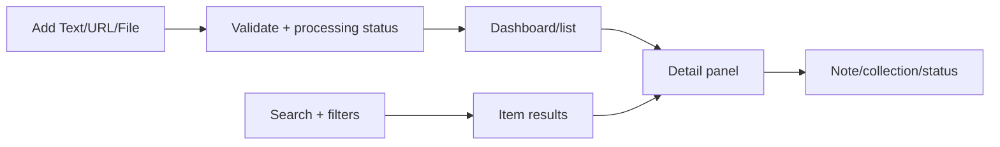

# Design — Core flows and screens

## Screen inventory

| Screen/surface | Primary purpose |
| --- | --- |
| Dashboard | Overview, filters, recent items, KPI và analytics |
| Add dialog/form | Tạo Text, URL hoặc File item |
| Item list | Duyệt kết quả filter/search |
| Detail panel | Đọc content/source, sửa metadata, note, collection/status |
| Search results | Excerpt, score/mode và mở item |
| Collections | Tạo, đổi tên, xóa và lọc collection |
| Settings/maintenance | Full-mode config, health, backup/rebuild cho advanced user |

## Primary flow

## Interaction rules

- Add mặc định tạo item trong inbox; title và collections là tùy chọn.
- Detail hiển thị snapshot toàn văn, provenance, current job state và tối đa năm related items khi khả dụng.
- Chỉ text source sửa content trực tiếp; URL/file giữ snapshot.
- Delete luôn cần confirmation và ẩn item ngay khi thành công.
- Click collection/chart mở list với filter tương ứng.
- Search result là item-level, không buộc người dùng hiểu chunk.
