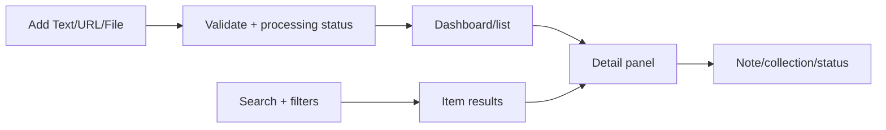

# Design — Core flows and screens

## Screen inventory

| Screen/surface | Milestone | Primary purpose |
| --- | --- | --- |
| Dashboard | M1; M3 extensions | Shell/list in M1; KPI and analytics surfaces in M3 |
| Add dialog/form | M1 | Create a text, URL, or file item |
| Item list | M1; M3 extensions | Browse items in M1; retrieval filters/search in M3 |
| Detail panel | M1 | Read content/source; edit metadata, notes, collections, and status |
| Search results | M3 | Excerpt, score/mode, and item opening |
| Collections | M1 | Create, rename, delete, and filter collections |
| Settings/maintenance | M4 | Full-mode config, health, and backup/rebuild for advanced users |

## Primary flow

## Interaction rules

- Add creates an item in `inbox` by default; title and collections are optional.
- Detail shows the full snapshot, provenance, current job state, and up to five related items when available.
- Only text sources edit content directly; URL/file sources retain their snapshot.
- Delete always requires confirmation and hides the item immediately after success.
- Clicking a collection/chart opens the list with the corresponding filter.
- Search results are item-level; users do not need to understand chunks.
