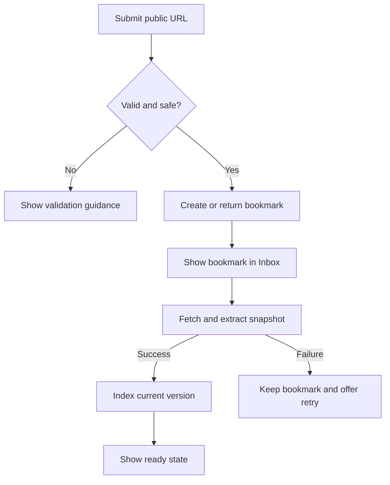

# Core flows

## Capture

The user receives a durable bookmark before enrichment completes. Duplicate submission opens or returns the existing bookmark and applies only explicitly requested organization changes.

## Organize and review

1. Open a bookmark from Inbox, Library, collection, tag, search, or analytics drill-down.
2. Edit title/description, status, collections, tags, or notes.
3. Save each action independently so an indexing failure cannot discard personal context.
4. Close detail and return to the exact prior browse/search context.

## Retrieve

1. Enter a query and optional shared filters.
2. Use hybrid mode by default when the semantic provider and index are ready.
3. Use local keyword mode when semantic service is unconfigured or degraded.
4. Show bookmark-level results and identify the mode actually used.
5. Opening and closing a result preserves retrieval context.

## Configure semantic search

1. Enter compatible endpoint, model, API key, timeout, and required connection settings.
2. Verify connectivity without persisting consent implicitly.
3. Review the disclosure that snapshot text and semantic queries leave the computer.
4. Explicitly enable consent.
5. Start or resume indexing and show progress.
6. Revocation immediately stops new provider requests and returns retrieval to keyword mode.

## Delete and recover

Soft delete removes the bookmark immediately from user-facing surfaces and queues derived cleanup. Backup/restore operates on canonical data first; indexes and analytics are rebuilt afterward from current snapshots.
