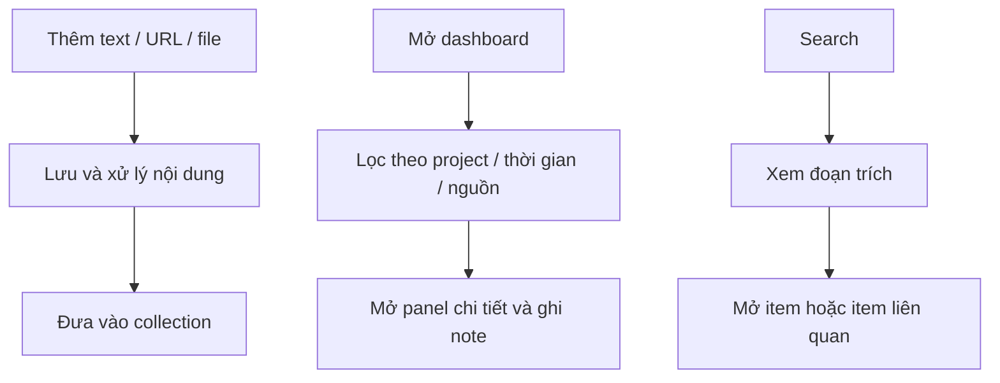

# InfoBoard — Tầm nhìn sản phẩm

InfoBoard là dashboard thông tin cá nhân chạy local, giúp thu thập, tổ chức và tìm lại text bằng từ khóa hoặc ngữ nghĩa. Dashboard là màn hình chính; URL và file là nguồn nhập.

## Phạm vi MVP

- Một người dùng trên máy cá nhân; giao diện tiếng Việt, tìm kiếm tiếng Việt và tiếng Anh.
- Nhận text nhập tay, bài web công khai, PDF có text, Markdown và TXT; lưu bản nội dung text để xem offline.
- Đơn vị chính là **mẩu thông tin** (`item`): tiêu đề, nội dung, nguồn, collections, note và thời điểm tạo/cập nhật.
- Một item thuộc nhiều collection; collection đại diện cho project hoặc lĩnh vực.
- Trạng thái tổ chức: `inbox` (mới thêm), `active` (đang sử dụng), `archived` (cất lại). Tách biệt trạng thái xử lý index.
- Embedding local mặc định; cho phép thay provider và chỉ gửi nội dung lên cloud khi người dùng cấu hình rõ ràng.

## Ba luồng sử dụng

## Giới hạn

MVP không có chat với dữ liệu, AI summary, recommendation feed, OCR, video transcript, ảnh web, tài khoản, sync hay cộng tác. Import bookmark và extension nằm ở giai đoạn sau.

Ảnh trong `docs/mockups/` là tham chiếu bố cục; dữ liệu, tags, hình ảnh và các nút ngoài phạm vi xuất hiện trong ảnh không tự trở thành yêu cầu.
