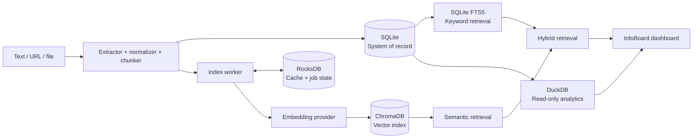

# Kiến trúc dữ liệu và trách nhiệm database — compatibility reference

Product scope, constraints và privacy boundary được mô tả trong [Internal PRD](../product/internal-prd/README.md); thuật ngữ chuẩn nằm tại [Domain model](../product/internal-prd/domain-model.md). Phần dưới đây giữ nguyên architecture reference để implementation docs tiếp tục dùng được.

## Nguyên tắc nền tảng

Mỗi hệ thống lưu trữ sở hữu một workload riêng. SQLite là nguồn dữ liệu sự thật; các database khác là lớp dẫn xuất, vận hành hoặc phân tích và phải có thể xây dựng lại từ SQLite cùng nội dung đã lưu.

## Mô hình dữ liệu MVP

SQLite dùng các bảng chính: `items`, `item_contents`, `chunks`, `collections`, `item_collections`, `notes`, `search_history` và `index_jobs`. `items.status` nhận `inbox`, `active` hoặc `archived`; trạng thái index nằm riêng trong `index_jobs`.

- Item có `id`, `source_type`, `source_url` hoặc `original_filename`, `title`, `content_hash`, `content_version`, `created_at`, `updated_at` và `deleted_at`.
- `item_contents` lưu snapshot text theo version; `chunks` có `item_id`, `content_version`, `chunk_index`, `text` và `content_hash`.
- `item_collections` là bảng liên kết nhiều-nhiều với khóa duy nhất `(item_id, collection_id)`.
- Bật foreign key, index các cột lọc thường dùng, và dùng soft delete trước khi cleanup các index dẫn xuất.
- FTS5 lập chỉ mục title và snapshot/chunk text; trigger hoặc service transaction phải giữ FTS đồng bộ với SQLite.

Migration SQL được đánh số và ghi `schema_version`. Mọi thay đổi schema phải có migration, test nâng cấp từ version trước và đường rollback dữ liệu rõ ràng.

## Tính nhất quán và phục hồi

SQLite commit item, snapshot, chunks và index job trước khi worker bắt đầu xử lý. ChromaDB và RocksDB chỉ được cập nhật sau đó; trạng thái cuối cùng được xác nhận lại trong SQLite. Nếu database dẫn xuất bị mất, worker có thể quét các chunks chưa indexed và dựng lại chúng từ SQLite.

Khi xóa item, UI ẩn item ngay bằng `deleted_at`; cleanup xóa vector và cache rồi mới dọn dữ liệu phụ thuộc. Backup tối thiểu gồm SQLite cùng thư mục snapshot; ChromaDB/RocksDB có thể phục hồi bằng lệnh rebuild.

## Tech stack đã chốt

| Lớp | Công nghệ | Vai trò |
| --- | --- | --- |
| Runtime | Python 3.12 | Ngôn ngữ và môi trường chạy ứng dụng. |
| Web | FastAPI + Uvicorn | HTTP API, routes và background tasks local. |
| UI | Jinja2 + HTMX + CSS tĩnh | Server-rendered dashboard, không cần SPA hay Node build step. |
| Dữ liệu chính | SQLite + FTS5 | Metadata, snapshot, quan hệ, keyword search và transaction. |
| Vector | ChromaDB | Semantic retrieval theo `chunk_id`. |
| KV/cache | RocksDB | Cache embedding và trạng thái index có thể tái tạo. |
| Analytics | DuckDB | Aggregate queries read-only trên dữ liệu SQLite. |
| Embedding | sentence-transformers | Provider local mặc định; cloud provider là implementation cấu hình thêm. |
| Trích xuất nội dung | Trafilatura, PyMuPDF, Markdown | Lần lượt xử lý bài web, PDF và Markdown/text. |
| Kiểm thử | pytest + httpx | Unit test, integration test và test HTTP API. |

Không dùng ORM ở MVP. Data-access layer sử dụng `sqlite3` của Python và SQL có version-controlled schema để giữ vai trò của từng database minh bạch, thuận lợi cho mục tiêu học kiến trúc dữ liệu của project.

## Cấu trúc project

```text
InfoBoard/
├── app/
│   ├── main.py                 # Khởi tạo FastAPI và đăng ký routes
│   ├── config.py               # Cấu hình local, storage và embedding provider
│   ├── routes/                 # HTTP handlers: items, collections, search, analytics
│   ├── models/                 # Pydantic request/response và domain types
│   ├── services/
│   │   ├── ingestion/          # URL/file/text extract, normalize, chunk
│   │   ├── embeddings/         # EmbeddingProvider và các implementation
│   │   ├── retrieval/          # Keyword, semantic và hybrid search
│   │   └── analytics/          # DuckDB dashboard queries
│   ├── storage/                # SQLite, ChromaDB, RocksDB adapters và schema
│   ├── templates/              # Jinja pages và HTMX partials
│   └── static/                 # CSS và JavaScript tối thiểu
├── data/                       # SQLite DB, Chroma/RocksDB files, snapshots; bị gitignore
├── tests/                      # Unit, integration và fixtures import/search
├── docs/plan/                  # Tài liệu quyết định sản phẩm và kiến trúc
├── pyproject.toml              # Dependencies, tooling và pytest config
├── .env.example                # Ví dụ cấu hình provider, không chứa secret
└── README.md                   # Cách cài đặt, chạy local và kiến trúc tóm tắt
```

`routes` chỉ điều phối HTTP, `services` chứa nghiệp vụ, và `storage` là ranh giới duy nhất với các database. Input adapter mới—bookmark HTML hay browser extension—được đặt dưới `services/ingestion/` để không tạo thêm luồng index riêng.

## SQLite: nguồn dữ liệu sự thật của ứng dụng

SQLite lưu dữ liệu sản phẩm bền vững:

- items và metadata nguồn;
- snapshot text đã trích xuất;
- chunks và định danh ổn định của chúng;
- collections và quan hệ nhiều-nhiều giữa item–collection;
- trạng thái đọc và note cá nhân theo item;
- lịch sử search và metadata cấu hình.

SQLite sở hữu các quan hệ để render trang reader, library và collection. Một item không bao giờ được xem là hợp lệ chỉ vì index còn tồn tại.

## ChromaDB: semantic retrieval index

ChromaDB lưu embedding theo `chunk_id` của SQLite. Nó trả về các `chunk_id` cùng score tương đồng; InfoBoard sau đó lấy metadata item và đoạn text có thẩm quyền từ SQLite.

ChromaDB không phải metadata store chính. Collection của nó có thể bị xóa và xây dựng lại bằng cách index lại chunks từ SQLite.

## RocksDB: trạng thái vận hành và cache

RocksDB xử lý dữ liệu key-value có tần suất cao và có thể tái tạo:

- trạng thái job index (`queued`, `extracting`, `embedding`, `completed`, `failed`);
- embedding cache theo `content_hash + embedding_provider + model_version`;
- tiến độ ngắn hạn hoặc retry marker khi cần.

Embedding cache tránh tính lại embedding nếu nội dung giống nhau được import lần nữa. Trạng thái item bền vững, có ảnh hưởng đến UI hoặc khả năng phục hồi của người dùng, cũng phải được phản chiếu trong SQLite.

## DuckDB: lớp analytics chỉ đọc

DuckDB gắn SQLite ở chế độ chỉ đọc để trả lời các truy vấn dashboard mà không tạo bản sao application database. Nó phục vụ các phép tổng hợp như item theo collection/nguồn, phân bố trạng thái đọc và hoạt động theo thời gian.

DuckDB không được dùng cho transactional write. Các truy vấn analytics phải suy giảm an toàn nếu extension local không khả dụng.

## Luồng dữ liệu


