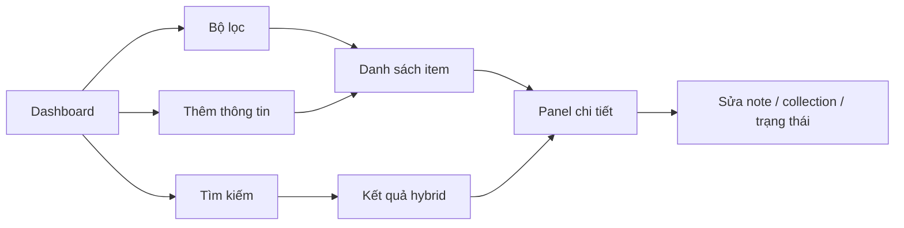

# Dashboard và giao diện MVP — compatibility reference

Định hướng trải nghiệm product-level mới nằm tại [`docs/product/03-core-experience.md`](../product/03-core-experience.md). Tài liệu này giữ contract và bố cục MVP hiện hành để các implementation docs không bị thay đổi.

## Bố cục

```text
┌──────────────┬──────────────────────────────────────────────┐
│ InfoBoard    │ Search                         + Thêm       │
│ Dashboard    ├──────────────────────────────────────────────┤
│ Tất cả       │ Collection · Nguồn · Trạng thái · Thời gian │
│ Collections  ├──────────────────────────────────────────────┤
│ Inbox        │ Tổng item | Mới trong kỳ | Collections | Job │
│ Active       ├────────────────────────┬─────────────────────┤
│ Archived     │ Thông tin gần đây      │ Hoạt động theo ngày │
│ Cài đặt      │                        │ Phân bố nguồn       │
│              ├────────────────────────┼─────────────────────┤
│              │ Collections            │ Nhóm nội dung       │
└──────────────┴────────────────────────┴─────────────────────┘
                         Click item → panel chi tiết bên phải
```

Luồng điều hướng chính:



- Sidebar 240 px, nội dung hai cột trên desktop; mobile một cột và menu thu gọn. Mobile là giao diện responsive, chưa hỗ trợ truy cập từ thiết bị khác.
- Bộ lọc lưu trong URL: collection, loại nguồn, trạng thái, khoảng ngày tạo. Mặc định 30 ngày và loại archived; có lựa chọn toàn thời gian.
- Tổng số liệu áp dụng cùng bộ lọc; số job đang chạy là toàn ứng dụng và phải ghi rõ.
- Item gần đây và tiến độ lấy từ SQLite; số đếm, biểu đồ ngày và phân bố nguồn/collection do DuckDB tổng hợp.
- Một item thuộc nhiều collection nên tổng số theo collection có thể lớn hơn tổng item; giao diện ghi chú điều này.
- Nhóm nội dung tương đồng được tính từ embedding; nhãn là tiêu đề item đại diện, không gọi LLM đặt tên. Ít hơn 5 item đã index thì hiển thị trạng thái chưa đủ dữ liệu.

## Tương tác

- Thêm thông tin: chọn Text/URL/File, nhập tiêu đề tùy chọn và nhiều collections; mặc định lưu vào inbox.
- Click item mở panel: toàn văn, nguồn, collections, trạng thái, note, sửa/xóa và tối đa 5 item liên quan.
- Chỉ sửa trực tiếp nội dung text nhập tay; URL/file giữ snapshot. Thay đổi text tạo phiên bản index mới.
- Click biểu đồ/collection/nhóm mở danh sách tương ứng. Search trả kết quả theo item với đoạn trích.
- Chưa có dữ liệu: hướng dẫn thêm item. Đang tải: placeholder. Lỗi index: lý do và nút thử lại. Analytics/vector lỗi: thông báo rõ vùng bị ảnh hưởng.
- Xóa cần xác nhận; đóng panel trả về đúng bộ lọc trước đó.

## HTTP API

Tiền tố `/api`; các trang và HTMX partial dùng routes riêng.

| Endpoint | Dữ liệu và kết quả |
| --- | --- |
| POST /items | JSON: source_type=text/url, text hoặc url, title?, collection_ids?; 202 với item_id, job_id |
| POST /items/upload | multipart: file, title?, collection_ids?; cùng kết quả tạo item |
| GET /items | Bộ lọc chung, limit=20 (tối đa 100), offset=0; items và total |
| GET /items/{id} | Nội dung, metadata, note, collections, trạng thái item và job |
| PATCH /items/{id} | title, note, status, collection_ids hoặc text đối với nguồn text |
| DELETE /items/{id} | 202; ẩn ngay và lên lịch dọn dữ liệu |
| POST /items/{id}/reindex | 202, job_id; dùng cho retry và index lại |
| GET/POST /collections | Danh sách hoặc tạo collection với name |
| PATCH/DELETE /collections/{id} | Đổi tên hoặc xóa quan hệ; không xóa item |
| POST /search | query, bộ lọc, limit tối đa 50; item_id, title, excerpt, score, retrieval_mode |
| GET /items/{id}/related | Tối đa 5 item tương đồng, loại chính item đang mở |
| GET /analytics | Bộ lọc chung; số đếm, biểu đồ, phân bố, nhóm nội dung |
| GET /health | Trạng thái SQLite, vector, cache, analytics; 503 khi SQLite không dùng được |

Danh sách mặc định sắp theo created_at giảm dần, rồi id; search theo score giảm dần. Lỗi JSON thống nhất: `{error: {code, message, details}}`; dùng 404, 409, 413, 422 hoặc 503 theo nguyên nhân.
