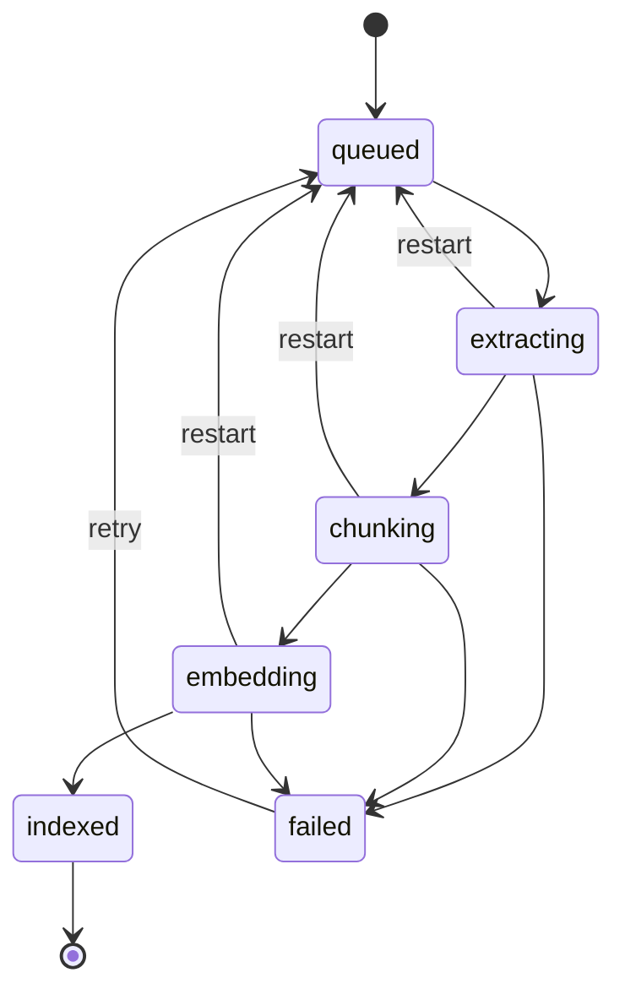

# Xử lý dữ liệu và tìm kiếm

## Job bền vững

- Một tiến trình Uvicorn, một worker tuần tự đọc job từ SQLite; không dựa riêng vào background task trong bộ nhớ.
- SQLite sở hữu trạng thái job; RocksDB giữ cache và bản tiến độ có thể bỏ đi.
- Mỗi bước ghi checkpoint; khi restart, job đang chạy được đưa về queued và chạy lại an toàn.
- Trùng URL chuẩn hóa hoặc hash nội dung: trả item cũ, không ghi đè note/trạng thái; bổ sung collection được chọn. Chuẩn hóa URL chỉ bỏ fragment, giữ query string.
- Retry/upsert theo item_id và content_version; kết quả phiên bản cũ không được công bố.
- Xóa: đánh dấu deleted trong SQLite và tạo job cleanup; mọi truy vấn loại item đó ngay. Worker xóa vectors, cache riêng của job rồi cascade nội dung SQLite. Cache embedding dùng chung giữ lại đến khi xóa cache toàn bộ.
- Backup khi đã dừng worker: SQLite và file gốc trong data; restore rồi dựng lại Chroma/RocksDB. Migration SQL đánh số, chạy transaction và ghi schema_version.

## Chuẩn hóa và embedding

- Text chuẩn hóa Unicode NFC và xuống dòng; giữ đoạn. PDF không có text báo chưa hỗ trợ OCR.
- Chia theo tokenizer của provider: tối đa 200 token, overlap 30, giảm xuống nếu giới hạn model thấp hơn; không cắt âm thầm.
- Chunk ID từ item_id + content_version + vị trí chunk. Cache key gồm hash text, provider, model revision và cấu hình embedding.
- Interface provider: embed(texts), model_id, revision, dimension, max_tokens, tokenize. Model local cụ thể và binding RocksDB được kiểm chứng ở bước thử kỹ thuật trước khi khóa dependency.
- Đổi model/revision tạo bộ index riêng và rebuild; chỉ chuyển index hoạt động khi hoàn tất. Chưa có index thì dùng keyword search.
- Cloud là adapter tùy chọn sau local; API key đọc từ môi trường, không ghi vào DB/log.

## Search và nhóm nội dung

- FTS5 tìm theo từ khóa trên title/text, cấu hình unicode61 với bỏ dấu; không diễn giải input người dùng thành cú pháp FTS trực tiếp.
- Lấy 50 chunks mỗi nhánh, áp dụng filters trước giới hạn; hợp nhất bằng Reciprocal Rank Fusion, k=60 và trọng số hai nhánh bằng nhau.
- Gom theo item, lấy score chunk tốt nhất và đoạn trích tương ứng; score là thứ hạng, không phải xác suất.
- Nếu lọc vector không đủ kết quả, mở rộng tập ứng viên đến hết phạm vi đủ điều kiện. Hydrate và kiểm tra lại trạng thái từ SQLite.
- Nhóm nội dung: trung bình vector chunks đã chuẩn hóa theo item, chuẩn hóa lại; gom theo cosine với ngưỡng cấu hình mặc định 0.75. Duyệt id cố định, gán vào nhóm có tâm gần nhất và cập nhật tâm; nhãn là title gần tâm nhất. Đây là heuristic cần kiểm tra trên dữ liệu Việt/Anh.
- Related lấy 5 item gần nhất theo cosine trong index đang hoạt động, loại deleted/archived và chính nó.

## Giới hạn và chạy local

- Bind 127.0.0.1; kiểm tra Host/Origin cho thao tác ghi, không bật CORS rộng.
- URL chỉ HTTP(S); kiểm tra IP thực kết nối và từng redirect, chặn địa chỉ nội bộ, giới hạn 5 redirect, timeout 30 giây.
- File tối đa 20 MB; tải HTML tối đa 5 MB; text sau extract tối đa 1 triệu ký tự hoặc 10.000 chunks/item. Báo lỗi thay vì cắt nội dung.
- Hiển thị text có escape; không render HTML nhập vào trực tiếp. Không ghi nội dung/query/API key vào log kỹ thuật.
- Lịch sử search lưu local, có thao tác xóa lịch sử. Dependencies frontend đóng gói local để không cần CDN khi dùng offline.
