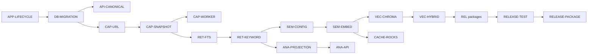

# Package dependency map

## Critical path

## Cross-path prerequisites

| Package | Additional prerequisites |
| --- | --- |
| ORG-CONTEXT | DB-MIGRATION, API-CANONICAL |
| ORG-LEGACY | DB-MIGRATION, CAP-SNAPSHOT |
| ORG-UI | API-CANONICAL, CAP-SNAPSHOT, ORG-CONTEXT, ORG-LEGACY |
| VEC-HYBRID | RET-KEYWORD, VEC-CHROMA |
| ANA-PROJECTION | ORG-CONTEXT, RET-FTS |
| REL-HEALTH | CAP-WORKER, SEM-CONFIG, VEC-CHROMA, CACHE-ROCKS, ANA-PROJECTION |
| REL-RECOVERY | DB-MIGRATION and every derived-store package |
| REL-SECURITY | CAP-URL, SEM-CONFIG, API-CANONICAL |
| RELEASE-COMPAT | API-CANONICAL and one completed compatibility release before removal |

A package may begin discovery early, but its authoritative tasks cannot be completed before all listed prerequisites are done.
