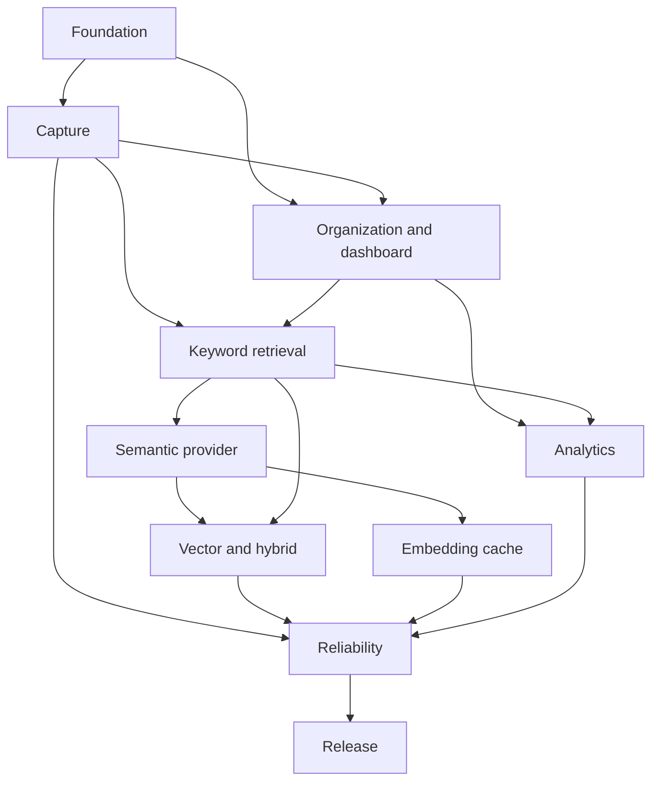

# Implementation roadmap

## Dependency graph

## Milestones

| Order | Outcome | Exit evidence |
| --- | --- | --- |
| M10 | Settings, lifespan, migrations, canonical repositories and API conventions | Clean install/migration and contract tests |
| M20 | Safe URL identity, capture attempts, immutable snapshots and worker recovery | Capture, retry, restart and SSRF tests |
| M30 | Organization, legacy preservation and usable dashboard states | API/browser evidence for ORG and UX |
| M40 | Rebuildable current-version FTS and keyword retrieval | Retrieval/filter/rebuild evaluation |
| M50 | Environment secret, provider consent and validated embeddings | Privacy tests and configured-provider smoke |
| M60 | Chroma vector retrieval and deterministic hybrid fallback | Relevance, stale filtering and outage tests |
| M70 | RocksDB embedding reuse without authority leakage | Hit/miss/corruption/revocation tests |
| M80 | Bounded analytics with DuckDB/SQLite parity | Projection, interruption and parity tests |
| M90 | Health, security, backup, restore and rebuild | Security and disaster-recovery transcripts |
| M99 | Complete CI, packaging and compatibility release | MVP acceptance and release evidence |

No milestone may bypass an unresolved data-safety prerequisite. Cross-cutting tests are added with their package and consolidated at M90/M99.
