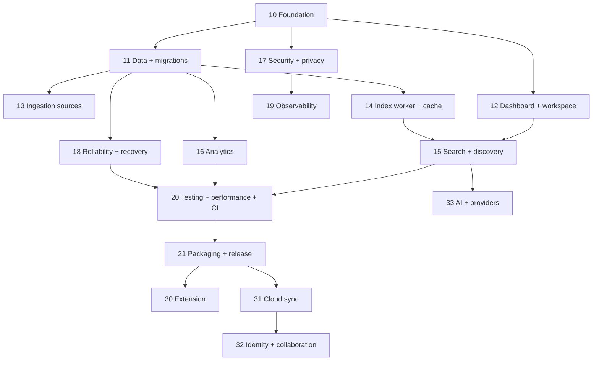

# 02 — Master roadmap

**Status:** `ready`
**Release target:** MVP local-first trước, hậu MVP theo discovery gate

## Dependency graph

## Milestones

### M0 — Documentation and baseline

Hoàn thiện bộ implementation docs, gap analysis, contracts, risk register và traceability. Không thay đổi runtime.

### M1 — Usable local dashboard

Epic `10–12`: foundation, schema contract và dashboard/item workspace. Acceptance: thêm text, list, filter, mở panel, note, collection, edit/delete.

### M2 — Reliable ingestion

Epic `13–14`: năm nguồn nhập, chunk/version, worker retry/restart và trạng thái UI. Acceptance: import/retry/restart không mất dữ liệu.

### M3 — Search and insights

Epic `15–16`: FTS5 hardening, optional semantic, RRF, related, clusters và analytics. Acceptance: keyword luôn hoạt động; full mode có semantic.

### M4 — Hardened MVP release

Epic `17–21`: security, backup/recovery, observability, test/benchmark, packaging và release. Acceptance: quality gates trong `20` pass.

### M5+ — Product expansion

Epic `30–33` lần lượt qua discovery, prototype, decision review rồi mới chuyển thành implementation-ready.

## Gate chuyển milestone

Không bắt đầu milestone sau nếu: migration chưa verified, acceptance của milestone trước chưa pass, branch chưa merge, hoặc risk blocker chưa có mitigation được chấp thuận.

## Quy tắc ưu tiên

Data integrity và local usability ưu tiên hơn semantic recall; fallback an toàn ưu tiên hơn dependency mới; đo lường trước tối ưu; chỉ thêm capability hậu MVP khi không phá core mode.
