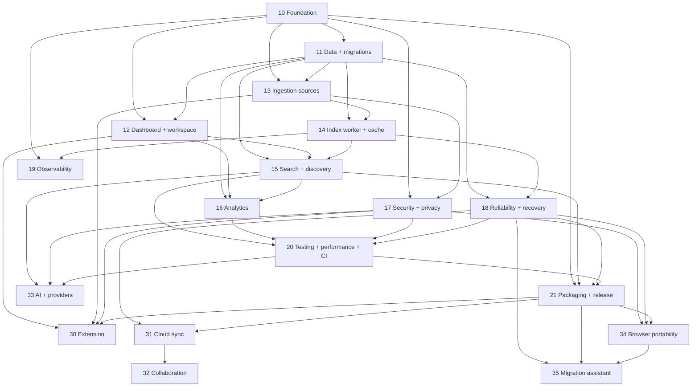

# 02 — Master roadmap

**Status:** `ready`
**Release target:** MVP local Advanced Bookmark Manager first; post-MVP follows discovery gates

## Dependency graph

## Milestones

### M0 — Documentation and baseline

Implementation packages, gap analysis, contracts, risk register, indexes, and traceability are maintained without changing runtime.

### M1 — Usable local dashboard

Epics `10–12`: foundation, schema contract, dashboard/item workspace, text capture, collections, notes, edit, and delete.

### M2 — Reliable ingestion

Epics `13–14`: five input sources, chunk/versioning, worker retry/restart, and technical-to-UI state mapping.

### M3 — Search and insights

Epics `15–16`: FTS5, optional semantic search, RRF, related/clusters, analytics, evaluation, and fallback.

### M4 — Hardened MVP release

Epics `17–21`: security, recovery, observability, tests/benchmarks, packaging, and release.

### M5+ — Product expansion

Packages `30–35` remain discovery-only until prototype, decision, threat, compatibility, and acceptance gates pass.

## Milestone gate and priority

Do not start the next milestone until migrations are verified, the prior acceptance gate passes, the branch is merged, and blockers have an approved mitigation. Data integrity and local usability outrank semantic recall; safe fallback outranks a new dependency; measurement precedes optimization.
