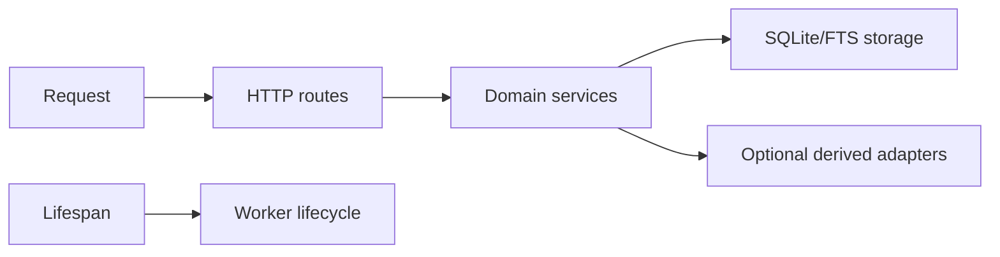

# 10 — Application foundation

**Status:** `partial`  
**Milestone:** M1  
**Dependencies:** 11, 17  
**Target branch:** `dev`

## Outcome

Ứng dụng có ranh giới rõ giữa HTTP routes, domain services và storage adapters; chạy ổn định từ project root trên Python 3.12; lỗi runtime được chuyển thành response thân thiện.

## Hiện trạng và gap

`app/main.py` hiện chứa hầu hết route và logic; template path đã absolute nhưng cấu hình/lifespan còn tối giản. Cần tách module mà không phá API hiện có hoặc database local.

## In/out of scope

In-scope: config object, route registration, dependency wiring, startup/shutdown, static/template serving, exception handlers và component health. Out-of-scope: authentication, async job queue ngoài process và SPA.

## Thiết kế

- `Settings` đọc `.env` với path được resolve theo project root hoặc path tuyệt đối.
- Lifespan gọi `init_db()` đúng một lần, khởi động worker theo cấu hình và shutdown graceful.
- Route chỉ parse/validate request, không tự viết SQL ngoài storage boundary.
- Exception handler map `ValueError`, `NotFound`, `Conflict`, limit errors và storage errors về contract chung.

## Commit slices

1. `refactor: introduce settings and application factory`
2. `refactor: split api routes from domain services`
3. `fix: make startup shutdown and template errors explicit`
4. `test: cover app factory and lifespan`

## Compatibility, failure và observability

Giữ nguyên entrypoint `app.main:app` và các URL hiện có trong một release. Startup fail-fast nếu SQLite không mở được; derived dependency chỉ degraded. Log lifecycle bằng component/job ID, không log content.

## Test matrix và acceptance

- Factory tạo app với temp settings và không dùng database mặc định.
- Lifespan init một lần, shutdown không để task treo.
- `/`, `/api/health`, lỗi 404/400/500 đều dùng response hợp lệ.
- `uv run pytest -q` và `uv run ruff check .` pass.

## Review gate

Reviewer kiểm tra import graph không vòng, entrypoint vẫn chạy, test không chạm `data/infoboard.db`, và diff không thay đổi behavior ngoài contract đã ghi.

## Execution log

Chưa bắt đầu; cập nhật commit hash, test output và PR sau khi triển khai.
