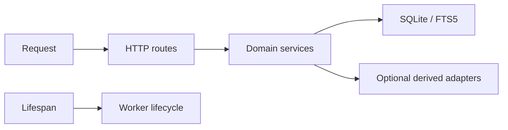

# 10 — Application foundation

**Plan status:** `ready`  
**Delivery status:** `not_started`  
**Baseline coverage:** `partial`  
**Milestone:** M1  
**Dependencies:** —

## Outcome

The application has clear HTTP route, domain service, and storage boundaries. It runs from the project root on Python 3.12 and turns runtime failures into stable, user-facing responses.

## Scope

In scope: settings, route registration, dependency wiring, startup/shutdown, static/template serving, exception handlers, and component health. Out of scope: authentication, an external async queue, and an SPA.

## Design and contracts

- The target `Settings` boundary resolves configuration from explicit environment values and, only after a later implementation decision, may load a project-root `.env` file. The current runtime reads `INFOBOARD_DB` from the process environment only.
- Lifespan calls `init_db()` once, starts the configured worker, and shuts down gracefully.
- Routes parse and validate requests; SQL stays behind the storage boundary.
- Exception handlers map `ValueError`, `NotFound`, `Conflict`, limit errors, and storage errors to the shared response contract.
- The public entrypoint remains `app.main:app` during the release.

## Failure and observability

Startup fails fast if SQLite cannot open. Derived dependencies report degraded mode. Lifecycle logs include component/job IDs and never include content.

## Test and acceptance contract

- The factory can use temporary settings and never touches the default database in tests.
- Lifespan initializes once and leaves no task running after shutdown.
- `/`, `/api/health`, and 404/400/500 paths return the shared response shape.
- `uv run pytest -q` and `uv run ruff check .` pass for the implementation slice.

## Review gate

Review the import graph, entrypoint compatibility, temporary database isolation, and behavior diff. No unrelated API behavior may change.
