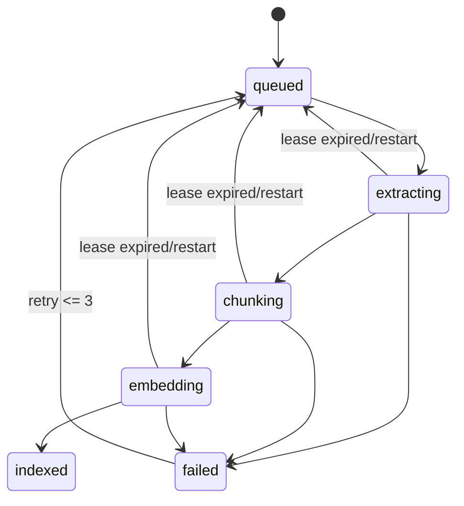

# 14 — Indexing worker và cache

**Status:** `partial`  
**Milestone:** M2–M3  
**Dependencies:** 11, 13, 15  
**Source of truth:** SQLite job state

## Outcome

Job index durable, idempotent và phục hồi được sau crash; derived vector/cache có thể mất và dựng lại mà không mất item hoặc note.

## Lifecycle

Worker tuần tự trong process MVP; claim job bằng transaction/lease, checkpoint sau mỗi bước, retry tối đa 3 lần với error code. Không dùng in-memory queue làm nguồn trạng thái.

## Chunk/vector rules

Chunk tối đa 200 token, overlap 30 theo provider tokenizer; ID ổn định từ item/version/position. Upsert vector idempotent; active model/revision không trộn với index cũ.

## RocksDB cache

Optional cache key gồm content hash, provider, model revision, dimension và chunk config. Cache miss không lỗi job; cache corruption được bỏ qua và tính lại. SQLite phản chiếu state có ảnh hưởng UI/recovery.

## Commit slices

1. `feat: add durable job claim and lease fields`
2. `feat: implement checkpointed indexing worker`
3. `feat: add retry requeue and graceful shutdown`
4. `feat: add optional rocksdb embedding cache`
5. `feat: add item and full reindex commands`
6. `test: cover worker crash retry idempotency and rebuild`

## Failure/recovery

Job đang `extracting/chunking/embedding` khi restart trở về `queued`; job quá 3 lần chuyển `failed` và giữ error message an toàn. Xóa item trước khi job chạy phải cancel/skip và cleanup derived index.

## Acceptance

Restart không mất job; retry không tạo duplicate chunks/vectors; reindex item tạo version/job đúng; model đổi rebuild index mới; keyword search vẫn hoạt động khi worker/Chroma lỗi.

## Review gate

Có test kill/restart worker, inspect SQLite state trước/sau, verify cleanup và log chỉ gồm job ID/step/duration/error code.

## Execution log

Worker hiện chuyển trạng thái đồng bộ trong `app/worker.py`; chưa có lease/cache thật.
