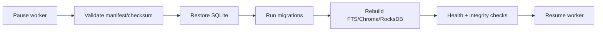

# 18 — Reliability, backup và recovery

**Status:** `draft`
**Milestone:** M4
**Dependencies:** 11, 14, 17, 19

## Outcome

Người dùng có thể backup/restore dữ liệu chính, rebuild derived index và phục hồi sau crash mà không mất content, note, collection hoặc job cần xử lý.

## Backup format

- SQLite copy nhất quán sau checkpoint hoặc khi worker pause.
- Source snapshots/original metadata trong thư mục backup versioned.
- Manifest gồm app version, schema version, model/index metadata, timestamp và checksum.
- Không backup secret/API key; quyền file backup theo user.

## Restore flow

## Maintenance commands

`python -m app.cli backup --output PATH`, `restore --input PATH`, `reindex`, `cleanup`, `verify`. Restore không overwrite path hiện tại nếu chưa có `--confirm` và backup safety copy.

## Commit slices

1. `feat: add sqlite backup manifest and verify command`
2. `feat: add safe restore and migration flow`
3. `feat: add derived index cleanup and rebuild`
4. `feat: add crash recovery integrity checks`
5. `test: cover backup restore delete and rebuild`

## Acceptance

Backup restore trên máy sạch khôi phục đúng counts/content/notes/collections; Chroma/RocksDB bị xóa vẫn rebuild được; interrupted restore không làm hỏng bản gốc; deleted item không quay lại public list.

## Review gate

Có checksum/manifest sample, transcript command, before/after query comparison và documented rollback. Không thao tác destructive trên `data/` của developer trong test.

## Execution log

Chưa có CLI backup/restore; hiện chỉ có soft delete và reindex cơ bản.
