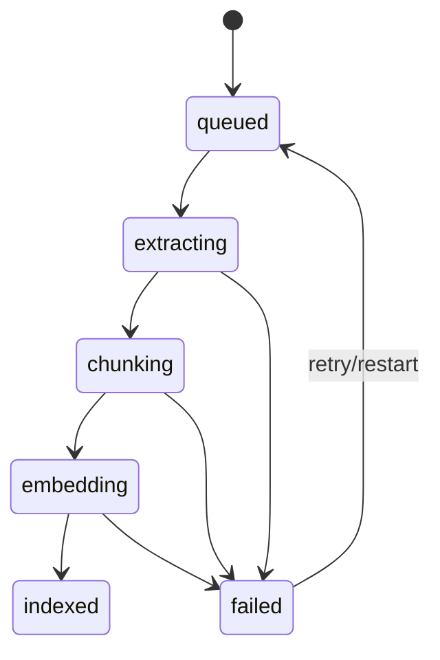

# 14 — Indexing worker and cache

**Plan status:** `ready`  
**Delivery status:** `not_started`  
**Baseline coverage:** `partial`  
**Milestone:** M2  
**Dependencies:** 11, 13

## Outcome

Indexing is durable and restartable. SQLite remains the system of record while FTS, semantic vectors, and caches are derived stores.

## Job lifecycle

The UI maps `extracting | chunking | embedding` to `processing`; the technical states remain available in logs and diagnostics.

## Index and cache rules

- Chunks use content version and stable `position`; chunk text/hash are reproducible.
- FTS is rebuilt from SQLite when unavailable or stale.
- Semantic indexing is optional and reports degraded mode when its dependency is unavailable.
- RocksDB cache is disposable and never required to recover canonical content.
- `retry_count` is bounded and incremented transactionally with job state.

## Failure, recovery, and acceptance

A worker restart reclaims stale jobs safely. A failed derived write never deletes the item or snapshot. Retry exhaustion records a stable failure reason and leaves the item recoverable.

- Jobs survive process restart without duplicate chunks.
- Retry and backoff are observable.
- FTS remains searchable in core mode.
- Semantic/cache failure is a degraded, repairable condition.
