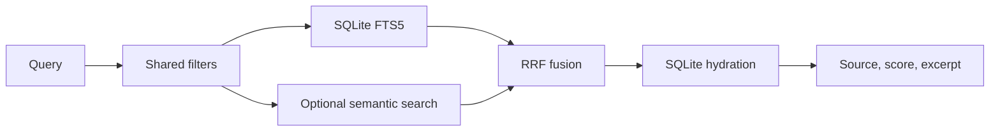

# 15 — Search and discovery

**Plan status:** `ready`  
**Delivery status:** `not_started`  
**Baseline coverage:** `partial`  
**Milestone:** M3  
**Dependencies:** 11, 12, 14

## Outcome

Users can find saved items by keyword in core mode. Full mode may add semantic similarity, with stable source provenance and safe fallbacks, but is not required for a core MVP release.

## Retrieval pipeline

- FTS query input is sanitized and always available in core mode.
- Semantic search is optional and never becomes a hard dependency for keyword results or a core-only release.
- Hybrid retrieval uses RRF and hydrates final records from SQLite.
- Related items and clusters include provenance and explicit empty/degraded states.
- Shared filters have identical semantics for search and analytics.

## Acceptance and evaluation

- Core-mode Vietnamese/English keyword fixtures meet the agreed top-five retrieval target.
- Full-mode semantic/hybrid fixtures are required only when full mode is included in release scope.
- FTS returns safe excerpts/highlights without leaking deleted content.
- Semantic/provider failure preserves keyword results and reports degraded mode.
- Related/cluster output can be traced to source items.
- Warm and cold latency, recall, and fallback results are recorded in the evaluation report.

## Review gate

Review query sanitization, ranking behavior, deleted-item filtering, provider absence, and benchmark reproducibility before enabling full mode.
