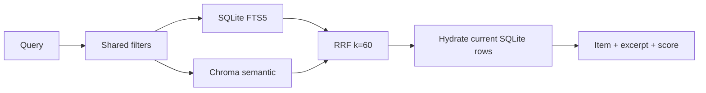

# 15 — Search và discovery

**Status:** `partial`
**Canonical references:** [Product requirements](../../../../product/internal-prd/02-product-requirements.md) · [Search architecture](../../../../architecture/05-search-and-analytics.md) · [Search evaluation](../../../../quality/02-search-and-performance-evaluation.md)
**Milestone:** M3
**Dependencies:** 11, 14
**Modes:** core keyword, full hybrid

## Outcome

Người dùng tìm được item bằng keyword hoặc ngữ nghĩa, kết quả được lọc nhất quán, hydrate từ SQLite và luôn có fallback khi derived index unavailable.

## Retrieval pipeline

- Sanitize query thành token an toàn, không cho người dùng chèn FTS syntax.
- Mỗi nhánh lấy tối đa 50 chunks trong filter scope; gom theo item.
- RRF trọng số equal, score là ranking score không phải xác suất.
- Excerpt/highlight được tạo từ text đã escape; deleted/archived theo filter không lọt vào.

## Semantic contract

Provider expose `embed`, `model_id`, `revision`, `dimension`, `max_tokens`, `tokenize`. Chroma persistent theo chunk ID; metadata model/index version được lưu để detect rebuild. Model chỉ load một lần/lazy sau prepare.

## Related và clusters

Related tối đa 5 item theo cosine trong active index, loại item hiện tại/deleted/archived. Cluster heuristic cosine threshold mặc định 0.75, nhãn là title gần centroid; dưới 5 indexed items hiển thị insufficient-data.

## Commit slices

1. `feat: harden fts query sanitization and filtered excerpts`
2. `feat: add chromadb persistent semantic retrieval`
3. `feat: connect embedding metadata and model rebuild`
4. `feat: merge keyword and semantic results with rrf`
5. `feat: add related items and topic clusters`
6. `test: cover search filters multilingual and degraded modes`

## Acceptance

Core mode search pass không cần full extra; full mode trả retrieval source/mode; Chroma outage không làm 500 toàn search; 20 multilingual queries có item đích top-5 ít nhất 16 query; score/excerpt ổn định.

## Review gate

Review fixture query Việt có dấu/không dấu và English, verify deleted/filter boundaries, model metadata/rebuild và benchmark warm model.

## Execution log

Hiện có FTS5 và RRF utility; Chroma pipeline chưa triển khai.
