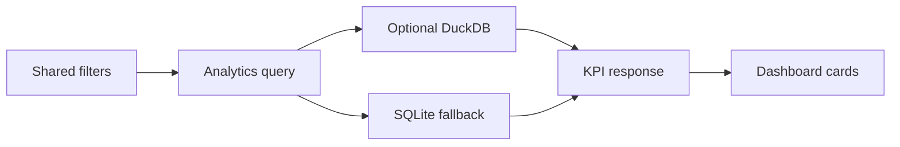

# 16 — Analytics and insights

**Plan status:** `ready`  
**Delivery status:** `not_started`  
**Baseline coverage:** `partial`  
**Milestone:** M3  
**Dependencies:** 11, 12, 15

## Outcome

The dashboard exposes useful item and retrieval KPIs using the same filters as the item list, while remaining safe when DuckDB or another derived dependency is unavailable.

## Query contract

- Analytics accepts the shared date, collection, status, and source filters.
- SQLite is the correctness fallback; DuckDB may accelerate analytics in full mode.
- KPI responses identify their data mode and degraded reason when applicable.
- Analytics never returns raw sensitive content or bypasses item visibility/deletion rules.

## Pipeline

## Acceptance and review

- DuckDB and SQLite return equivalent KPI values for the fixture set.
- Derived-store failure returns a truthful degraded response, not an empty success.
- Dashboard filters have parity with list/search filters.
- Query latency and warm-up behavior are recorded in the benchmark report.
