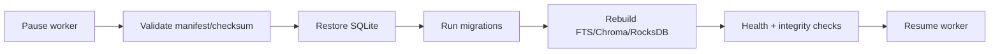

# 18 — Reliability, backup, and recovery

**Plan status:** `ready`  
**Delivery status:** `not_started`  
**Baseline coverage:** `missing`  
**Milestone:** M4  
**Dependencies:** 11, 14

## Outcome

Users can back up and restore canonical data, rebuild derived indexes, and recover after a crash without losing content, notes, collections, or actionable jobs.

## Backup and restore contract

- A consistent SQLite copy is made after checkpoint or worker pause.
- Source snapshots and original metadata are stored in a versioned backup directory.
- The manifest records app/schema versions, model/index metadata, timestamp, and checksums.
- Secrets and API keys are excluded; backup files use user-only permissions.

## Maintenance interface

Target commands are `python -m app.cli backup --output PATH`, `restore --input PATH`, `reindex`, `cleanup`, and `verify`. Restore must not overwrite the active path without an explicit confirmation and safety copy.

## Acceptance and review

- Clean-machine restore preserves counts, content, notes, and collections.
- Deleted derived stores rebuild from SQLite.
- Interrupted restore leaves the original active copy usable.
- Deleted items do not return to public lists.
- A checksum/manifest sample, transcript, before/after comparison, and rollback record are reviewed.
