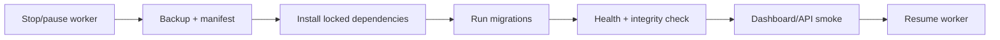

# 21 — Packaging, release, and upgrades

**Plan status:** `ready`  
**Delivery status:** `not_started`  
**Baseline coverage:** `missing`  
**Milestone:** M4  
**Dependencies:** 10, 11, 18, 20

## Install modes

- Core: `uv sync`, SQLite/FTS5, basic ingestion, and keyword search.
- Full: target `uv sync --extra full`, ChromaDB, sentence-transformers, `rocksdict`, DuckDB, and real providers.
- Model preparation is an explicit command; a dashboard request never downloads a model silently.

The full extra is a target capability until it is present in the dependency manifest and verified on a clean checkout.

## Release and upgrade contract

The release artifact includes app version, `uv.lock`, migrations, setup README, changelog, architecture diagrams, runbooks, and compatibility matrix. `data/` and `.env` are excluded; `.env.example` contains no secrets.

Rollback uses code revert/release rollback and data restore; automatic schema downgrade is not supported.

## Acceptance and review

- A new developer can run core mode from the README.
- Full mode reports missing dependency/model clearly.
- Upgrade from the current DB preserves data.
- Release checklist contains test, lint, backup, restore, and rollback evidence.
