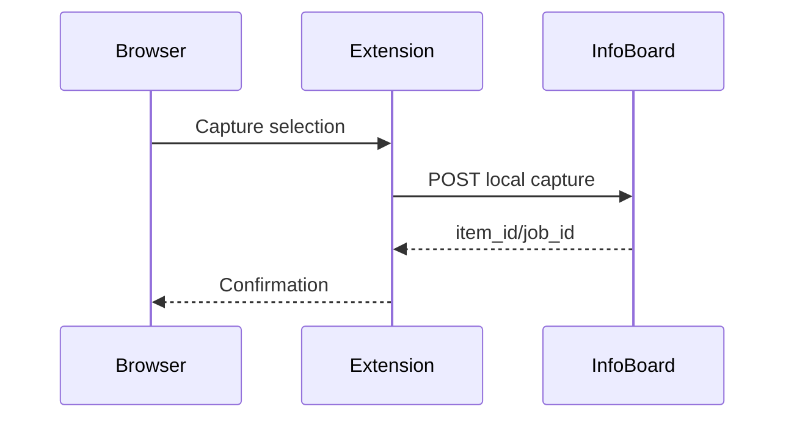

# 30 — Browser extension và capture

**Status:** `discovery`
**Canonical product reference:** [Browser extension](../../../product/next-plan/01-browser-extension.md)
**Milestone:** M5
**Dependencies:** 12, 13, 17, 21

## Product outcome

Cho phép capture URL, selection hoặc page metadata từ trình duyệt vào InfoBoard local mà người dùng hiểu rõ permission và trạng thái import.

## Discovery questions

- Extension cần hỗ trợ browser nào và có cần store distribution không?
- Capture chỉ gửi URL/selection hay snapshot HTML ở extension?
- Local handshake dùng native messaging, localhost endpoint hay file protocol?
- Hành vi khi app tắt, URL private hoặc network lỗi là gì?

## Prototype gate

Prototype tối thiểu gửi selection + URL tới local endpoint, hiển thị success/error, không chứa secret và không cần account. Đo permission surface, duplicate behavior và offline queue trước khi chốt API.

## Candidate flow

## Implementation-ready gate

Chỉ chuyển `ready` khi đã chốt browser matrix, permission/consent, payload version, authentication/handshake, retry/offline behavior, security review và migration khỏi `/api/items/url`.

## Risks

Extension permission quá rộng, localhost port probing, page content không đáng tin, app không chạy và store policy. Không triển khai trước khi threat model trong epic `17` được mở rộng.

## Execution log

Chưa discovery.
