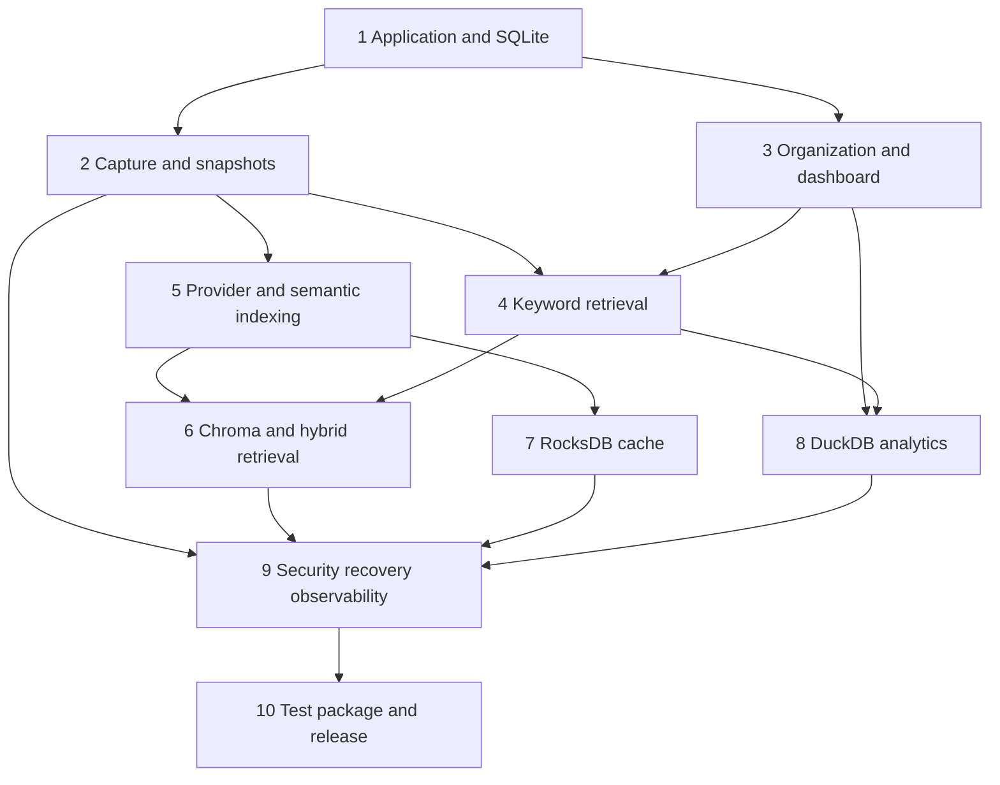

# Implementation roadmap

## Dependency graph

## Milestones

| Stage | Outcome | Exit gate |
| --- | --- | --- |
| 1. Application and SQLite foundation | Versioned migrations, settings, lifespan, canonical repositories, derived FTS, stable errors/health | Clean temporary install and migration evidence; no user data paths in tests |
| 2. Capture and snapshot lifecycle | URL normalization/dedup, capture attempts, durable bookmark-first capture, immutable snapshots, retry/restart | Capture/failure/recapture/SSRF scenarios satisfy `CAP-*` |
| 3. Organization and dashboard | Collections, tags, notes, status, legacy projection, detail/list context, responsive states | `ORG-*` and core `UX-*` browser/API evidence |
| 4. Keyword retrieval | Current-version FTS, shared filters, excerpts, rebuild | `RET-01`, `RET-02`, `RET-04` and keyword evaluation pass |
| 5. Provider and semantic indexing | Environment secret, config/consent, compatible embedding client, index revision, durable jobs | No-transfer-before-consent and configured real-provider smoke pass |
| 6. Chroma and hybrid retrieval | Revisioned vector index, canonical validation, deterministic fusion, fallback | `RET-03`–`RET-05` and semantic/hybrid evaluation pass |
| 7. RocksDB embedding cache | Revision-scoped cache, compatibility validation, bypass/rebuild/cleanup | Cache hit/miss/corruption/revocation scenarios pass |
| 8. DuckDB analytics | Refresh/checkpoint, bounded metrics, stale detection, SQLite fallback | `ANA-*` parity/interruption evidence pass |
| 9. Security, recovery, and observability | Limits, redaction, health, backup/restore, rebuild and cleanup | `PRI-*`, `REL-*`, security and recovery suites pass |
| 10. Test, package, and release | Complete CI, compatibility release, clean setup/upgrade/rollback, UI smoke, benchmark and docs alignment | Every MVP acceptance item verified or explicitly waived |

Stages express dependency, not permission to skip cross-cutting tests. Security and data-integrity tests are added with each feature and consolidated in stage 9. No subsequent stage starts while a prior schema/data-safety exit gate is unresolved.
